# 01 | 端到端流程与状态机（可实现规格）(E2E Flow & State Machine Spec)

> **Status (状态)**: Stable Spec (稳定规格，可直接落地实现)  
> **Audience (读者)**: Maintainers / Contributors (维护者/贡献者)  
> **Goal (目标)**: 定义 Agent 编排（Orchestrator）的端到端流程、状态机与关键边界条件（重试/幂等/回滚/错误码）。

本章给出一个可直接实现的“会话 → 规划 → 工具执行 → 验证 → 总结”的状态机，用于代理编排（Orchestrator/编排器）。

---

## 1. 端到端流程（E2E Flow）

### 1.1 单轮任务的标准闭环（One Turn Loop）
1. **用户输入 (User Input)**：自然语言任务描述（可含约束、期望输出、风险偏好）。
2. **接入与风控 (Intake & Risk Gate)**：意图识别、权限预判（写/删/执行/网络）、必要时进入确认态。
3. **澄清（可选）(Clarifying, Optional)**：提出 1~3 个关键问题；无法澄清则停止并等待。
4. **上下文构建 (Context Building)**：仓库信息（Repo Map/仓库映射）+ 相关文件片段 + 历史对话摘要。
5. **规划 (Planning)**：生成 Plan/Todo（步骤 + 验证策略 + 预期产物）。
6. **执行循环 (Executing Loop)**：
   - 读取/搜索（read/search）
   - 生成改动（patch/write/delete）
   - 运行验证（lint/test/build/custom）
   - 根据失败结果修复（fix/retry/rollback）
7. **总结 (Summarizing)**：改了什么、为什么、如何验证、风险与回滚建议。
8. **可选：Git 工作流 (Git Workflow, Optional)**：commit message / PR 描述（受策略保护）。

### 1.2 失败恢复路径（Failure Recovery）
- **工具失败 (Tool Failure)**：重试（仅幂等读类）→ 降级工具（语义检索失败回退 grep）→ 请求用户协助（缺依赖/权限不足）。
- **验证失败 (Verification Failure)**：最小化修复 → 回滚最近 patch（必要时）→ 局部重规划（Plan Patch）。
- **需求不清 (Ambiguous Requirement)**：停止执行，输出澄清问题并等待输入。

---

## 2. Orchestrator 状态机（State Machine）

### 2.1 状态定义（States）
- `IDLE`：等待用户输入。
- `INTAKE`：解析输入、策略预判（Policy/策略）、风险分级（Risk Level/风险等级）。
- `CLARIFYING`：提出澄清问题（可选）。
- `CONTEXT_BUILDING`：收集上下文（文件树、搜索结果、文件片段）。
- `PLANNING`：生成计划（Plan：步骤、依赖、验证）。
- `AWAITING_CONFIRMATION`：危险操作等待确认（写/删/执行/网络）。
- `EXECUTING`：按步骤执行（调用工具）。
- `VERIFYING`：运行 lint/test/build 或自定义验证。
- `RECOVERING`：处理失败，重试/回滚/降级/重规划。
- `SUMMARIZING`：生成总结与下一步建议。
- `DONE`：本轮结束。

### 2.2 事件（Events）
- `USER_MESSAGE(text)`
- `CLARIFICATION_ANSWER(text)`
- `TOOL_CALL_REQUEST(name, args)`
- `TOOL_CALL_RESULT(name, ok, payload)`
- `CONFIRM(yes/no, scope)`
- `TIMEOUT`
- `CANCEL`

### 2.3 转移规则（摘要）
- `IDLE` + `USER_MESSAGE` → `INTAKE`
- `INTAKE`：
  - 若缺关键上下文 → `CLARIFYING`
  - 否则 → `CONTEXT_BUILDING`
- `CONTEXT_BUILDING` → `PLANNING`
- `PLANNING`：
  - 若计划包含危险动作 → `AWAITING_CONFIRMATION`
  - 否则 → `EXECUTING`
- `EXECUTING`：
  - 任一步失败 → `RECOVERING`
  - 步骤完成 → `VERIFYING`
- `VERIFYING`：
  - 通过 → `SUMMARIZING`
  - 失败 → `RECOVERING`
- `RECOVERING`：
  - 可修复 → 回到 `EXECUTING`（生成修复步骤）
  - 不可修复 → `SUMMARIZING`（输出阻塞与手工步骤）
- `SUMMARIZING` → `DONE` → `IDLE`

---

## 3. 计划模型（Plan/Todo）数据结构（Serializable Models）

建议将计划抽象成可序列化结构，便于审计与回放。

### 3.1 Plan（计划）
- `plan_id: string`（计划 ID）
- `goal: string`（目标）
- `constraints: string[]`（约束，例如“不得改 API”、“不能访问网络”）
- `steps: Step[]`（步骤）
- `verification: VerificationPolicy`（验证策略）
- `risk_level: low|medium|high`（风险等级）
- `created_at: timestamp`（创建时间）

### 3.2 Step（步骤）
- `step_id: string`（步骤 ID）
- `title: string`（标题）
- `intent: string`（意图：为什么做）
- `tool_calls: ToolCallTemplate[]`（可选：预期要调用的工具）
- `expected_artifacts: Artifact[]`（预期产物，例如修改文件列表）
- `status: pending|in_progress|done|blocked|skipped`（状态）
- `rollback_hint: string`（可选：如何撤销）

### 3.3 VerificationPolicy（验证策略）
- `mode: none|lint|test|build|custom`（验证模式）
- `commands: string[]`（命令，例如 `npm test`）
- `required: boolean`（是否必须）
- `stop_on_fail: boolean`（失败是否中止）

---

## 4. 执行控制：重试、幂等与回滚（Retry / Idempotency / Rollback）

### 4.1 重试策略（Retry Policy）
- 仅对“幂等读取类工具（Idempotent Read Tools/幂等读工具）”默认重试：`read/search`。
- 对“写/执行类工具（Write/Exec Tools/写与执行工具）”不自动重试，必须由 Orchestrator 决策（避免副作用重复）。
- 指数退避（Exponential Backoff/指数退避）：\(200ms, 500ms, 1s\)，最多 3 次（可配置）。

### 4.2 幂等要求（Idempotency Requirements）
- `read_file/search`：幂等
- `apply_patch/write_file/delete_file`：非幂等，必须具备“预检 + 回滚”
- `run_terminal_cmd`：默认非幂等，需要安全策略与确认

### 4.3 回滚机制（Rollback Strategy）
- **补丁级回滚**：每次写入保存逆向 patch
- **Git 级回滚（可选）**：每个任务开分支或保存临时 commit

---

## 5. 失败分类与错误码（Error Taxonomy）

### 5.1 失败分类（Error Classes）
- `E_POLICY_DENIED`：策略拒绝（越权路径/危险命令/网络）
- `E_IO`：文件系统错误
- `E_TOOL_TIMEOUT`：工具超时
- `E_INVALID_ARGS`：参数不合法（schema 校验失败）
- `E_CONFLICT`：补丁冲突/并发写冲突
- `E_BUILD_FAIL`：构建/测试失败
- `E_MODEL`：模型输出不符合协议/解析失败

### 5.2 错误处理原则（Handling Principles）
- 给用户“下一步可操作建议”
- 对内部错误保留 trace_id，外部隐藏敏感信息

---

## 6. 图示（SVG）

> 说明：本项目原则上不在文档中保留 Mermaid 代码块；图统一以 SVG 链接方式引用，便于版本化与复用。

