# 13 | 交互界面与用户体验（可实现规格）(UI/CLI & UX Spec)

> **Status (状态)**: Stable Spec (稳定规格，已落地 OpenCode TUI)  
> **Audience (读者)**: Maintainers / Frontend Engineers (维护者/前端工程师)  
> **Goal (目标)**: 定义 Agent 的交互界面（UI/User Interface）与用户体验（UX/User Experience），提供高可读性、高响应速度与低认知负荷的终端环境。

---

## 1. 界面模式 (UI Modes)

本项目支持两种主要界面模式，以适应不同用户习惯：

### 1.1 OpenCode 风格 TUI (推荐)
> **实现 (Implementation)**: `src/clude_code/plugins/ui/opencode_tui.py` (基于 Textual)

- **布局 (Layout)**: 多窗格 (Multi-Pane) 设计。
  - **Conversation**: 顶部主对话区，显示 User/Assistant 消息，支持 Markdown 渲染。
  - **Status**: 侧边/顶部状态栏，显示 Token 使用 (Context/Output)、TPS、当前步骤。
  - **Events**: 底部/侧边事件流，显示工具调用、详细日志 (JSON 结构化)。
  - **Operations**: 操作面板，显示当前 LLM 请求进度 (Progress Bar)。
  - **Input**: 底部固定输入框，支持多行编辑。
- **交互 (Interaction)**:
  - **滚动**: 鼠标滚轮独立滚动各窗格。
  - **命令补全**: 输入 `/` 后按 `Tab` 触发 Slash Command 补全。
  - **历史搜索**: `Up/Down` 浏览历史，`Ctrl+R` 反向搜索。
- **优势 (Pros)**: 信息密度高，Log 不污染对话流，适合复杂任务调试。

### 1.2 Claude Code 风格 CLI (Enhanced)
> **实现 (Implementation)**: `src/clude_code/plugins/ui/enhanced_live_view.py` (基于 Rich Live)

- **布局 (Layout)**: 单一信息流 (Stream)，类似传统聊天软件。
- **交互 (Interaction)**: 线性追加，正在进行的步骤显示为动态 Spinner。
- **优势 (Pros)**: 简洁直观，适合简单问答或习惯传统 CLI 的用户。

---

## 2. UI 架构 (UI Architecture)

为了实现 TUI 的无阻塞响应，我们采用了 **双线程架构 (Dual-Thread Architecture)**。

### 2.1 架构图 (Architecture Diagram)

### 2.2 核心机制
1.  **Main Thread (UI)**: 运行 `Textual App`，负责渲染、接收键盘输入。
2.  **Background Thread (Agent)**: 运行 `AgentLoop`，执行耗时的 LLM 推理与工具调用。
3.  **Communication (Queue / 队列通信)**: 
    - UI -> Agent: `UserMessage` (用户输入)
    - Agent -> UI: `Event` (Trace=追踪ID, Token Usage=Token用量, Tool Result=工具结果)

---

## 3. 关键 UX 设计 (Key UX Decisions)

### 3.1 渐进式披露 (Progressive Disclosure)
- **默认**: 仅显示“思考中...”或高级别的步骤标题 (如 "Searching files...")。
- **展开**: 用户可点击或按键查看详细的 `audit.jsonl` 内容或工具原始输出。
- **`display` 工具**: 允许 Agent 主动推送结构化的中间状态（如进度条、Markdown 表格），打破“沉默的黑盒”。

### 3.2 确认机制 (Confirmation)
- **风险操作**: 写文件、执行命令、联网。
- **呈现**: 在 TUI 中显示高亮警告（目前 TUI 暂不支持模态弹窗，需在 CLI 确认或通过配置自动批准）。
- **默认策略**: `policy.confirm_write = True`。

### 3.3 实时反馈 (Real-time Feedback)
- **Streaming**: LLM 的 Token 流式输出。
- **Spinner**: 工具执行时的转圈动画。
- **Usage**: 实时刷新 Context Window 占用率，避免突然超限。

---

## 4. 业界对比 (Industry Comparison)

| 特性 | Clude Code (TUI) | Claude Code (CLI) | Aider | 评价 |
| :--- | :--- | :--- | :--- | :--- |
| **布局** | ✅ 多窗格 (Textual) | ❌ 单流 (Rich) | ❌ 单流 | **Clude 信息组织更强** |
| **历史回溯** | ✅ 独立滚动 | ❌ 需终端滚动 | ❌ 需终端滚动 | **Clude 体验更佳** |
| **输入体验** | ✅ 多行 + 补全 + 搜索 | ✅ 单行 | ✅ 单行 | **Clude 更强** |
| **视觉风格** | 科技感/高密度 | 极简/留白 | 极简 | 取决于偏好 |

---

## 5. 相关文档 (See Also)

- **工具协议 (Tool Protocol)**: [`docs/02-tool-protocol.md`](./02-tool-protocol.md)
- **可观测性 (Observability)**: [`docs/12-observability.md`](./12-observability.md)
