# 22 | P0-3 局部重规划：Plan Patching 设计与实现 (Plan Patching=计划补丁/增量重规划)

> **Status (状态)**: ✅ Completed（已完成）  
> **Scope (范围)**: Orchestrator / Planner / Execution（编排器/规划器/执行器）  
> **Goal (目标)**: 把"全量重规划（重写整个 Plan）"升级为"增量重规划（PlanPatch）"，降低成本与上下文丢失风险。
> **Regression Tests (回归测试)**: `tests/test_plan_patching.py` (10 cases, 100% pass)

---

## 1. As-Is：现有代码链路与问题 (As-Is=现状)

### 1.1 当前重规划行为
- **触发点**：`execute_plan_steps()` 中某个 step 失败（`failed`）后进入 `handle_replanning()`。
- **当前协议**：`handle_replanning()` 直接要求模型输出 **完整 `Plan` JSON**（严格 JSON）。
- **落地方式**：解析得到 `new_plan` 后，执行器把 `plan = new_plan` 且 `step_cursor = 0`，从头开始执行新计划。

### 1.2 现有问题（结合业界）
- **P0 成本问题 (Cost=成本)**：全量重写 Plan 会重复输出大量不变信息（Token 成本高）。
- **P0 上下文丢失 (Context Loss=上下文丢失)**：模型重写 Plan 时容易“忘记”已完成步骤/已验证结论，导致重复执行或偏航。
- **P0 运行时风险 (Runtime Risk=运行时风险)**：
  - 全量 Plan 可能改变已完成步骤，导致逻辑不一致。
  - 依赖关系更容易被破坏（例如依赖指向不存在的 step_id）。

> **业界做法（Claude Code/Aider/OpenCode 等思路抽象）**：优先做“局部修补”，只改失败/阻塞的局部步骤；并且协议必须结构化、可验证、可回退。

---

## 2. To-Be：PlanPatch 方案 (To-Be=目标态)

### 2.1 关键原则 (Principles=原则)
- **最小变更 (Minimal Change=最小变更)**：只改必要的 step，不重写整个计划。
- **不可变已完成步骤 (Done Steps Immutable=已完成步骤不可变)**：`status=done` 的 step 不允许被删除/修改。
- **可验证 (Verifiable=可验证)**：补丁必须可被运行时校验（ID 唯一、依赖存在、步数上限）。
- **可回退 (Fallback=回退)**：补丁解析/应用失败时，允许回退到“全量 Plan JSON”解析（兼容迁移期）。

### 2.2 协议：PlanPatch JSON（建议结构）

```json
{
  "title": "可选：更新后的任务标题",
  "remove_steps": ["step_x"],
  "update_steps": [
    {"id": "step_3", "description": "更新后的描述", "dependencies": ["step_1"], "tools_expected": ["grep"]}
  ],
  "add_steps": [
    {"id": "step_4", "description": "新增步骤", "dependencies": ["step_3"], "tools_expected": ["read_file"], "status": "pending"}
  ],
  "reason": "可选：为什么这样 patch（用于可观测性）"
}
```

说明（中文注释）：
- **remove_steps**：只允许删除非 `done` 的步骤。
- **update_steps**：只允许更新非 `done` 的步骤字段（description/dependencies/tools_expected）。
- **add_steps**：新增步骤会被强制设为 `pending`（避免模型写乱状态）。

---

## 3. 实现策略 (Implementation Strategy=实现策略)

### 3.1 Planner 增量能力
- 新增 `PlanPatch`、`PlanStepUpdate` Pydantic 模型（运行时校验）。
- 新增 `parse_plan_patch_from_text()`：从模型输出提取 JSON 并验证为 PlanPatch。
- 新增 `apply_plan_patch()` / `patch_plan()`：对旧 Plan 应用 patch，输出新 Plan。

### 3.2 Execution 侧接入
- `handle_replanning()`：改为优先要求模型输出 **PlanPatch JSON**；收到响应后：
  - **先尝试 parse+apply patch**
  - 失败则 **回退解析 full Plan**
- `execute_plan_steps()`：对齐增量计划语义，必须 **跳过 status=done 的步骤**，避免重复执行。

---

## 4. 健壮性护栏 (Robustness Guards=健壮性护栏)
- **ID 唯一性**：新增/更新后必须满足 step_id 唯一。
- **依赖存在性**：每个 `dependencies` 必须能在计划中找到对应 step_id。
- **步数上限**：`len(steps) <= cfg.orchestrator.max_plan_steps`，超限要截断新增部分并记录告警（Warning=告警）。
- **兼容期告警**：如果模型输出 full Plan（未输出 patch），允许继续执行，但要记录事件/日志便于观察迁移效果。

---

## 5. 验收标准 (Acceptance Criteria=验收标准)
- 当某个 step 失败触发重规划：
  - 默认请求 PlanPatch 并成功应用（事件可观测）。
  - 已完成步骤不会被重复执行。
  - patch 失败时能回退全量 Plan，且不会直接崩溃。

---

## 6. 回归测试覆盖 (Regression Test Coverage=回归测试覆盖)

测试文件：`tests/test_plan_patching.py`

| 测试类 (Test Class) | 用例数 (Cases) | 验证点 (Verification Points) |
|---------------------|----------------|------------------------------|
| `TestDoneStepsPreserved` | 2 | done 步骤状态保留、禁止更新 done 步骤 |
| `TestDependencyValidation` | 2 | 依赖不存在抛错、依赖存在正常应用 |
| `TestMaxStepsTruncation` | 2 | 超限截断并标记、未超限无截断 |
| `TestPatchParsing` | 2 | 正确解析 patch、不误解析 full plan |
| `TestDeleteSteps` | 2 | 删除 pending 成功、禁止删除 done |

运行命令：
```bash
conda run -n claude_code python -m pytest tests/test_plan_patching.py -v
```

---

## 7. 实现文件 (Implementation Files=实现文件)

| 文件 (File) | 职责 (Responsibility) |
|-------------|----------------------|
| `src/clude_code/orchestrator/planner.py` | `PlanPatch`/`PlanStepUpdate` 模型定义、`parse_plan_patch_from_text()`、`apply_plan_patch()` |
| `src/clude_code/orchestrator/agent_loop/execution.py` | `handle_replanning()` 优先解析 patch、`execute_plan_steps()` 跳过 done 步骤 |
| `src/clude_code/plugins/ui/opencode_tui.py` | `plan_patch_applied` 事件 UI 显示 |
| `src/clude_code/plugins/ui/enhanced_live_view.py` | `plan_patch_applied` 事件 UI 显示 |

---

## 8. 流程图 (Flow Diagram=流程图)


