# 23 | P0-2 控制协议结构化：Control Protocol 设计与实现 (Control Protocol=控制信号协议)

> **Status (状态)**: ✅ Completed（已完成）  
> **Scope (范围)**: Orchestrator / Execution / Prompts（编排器/执行器/提示词）  
> **Goal (目标)**: 把脆弱的字符串匹配（`STEP_DONE`/`REPLAN`）替换为结构化 JSON 信封，提升协议鲁棒性。

---

## 1. As-Is：现有代码链路与问题 (As-Is=现状)

### 1.1 当前控制信号处理
- **触发点**：`execute_single_step_iteration()` 中 LLM 返回后，解析是否包含控制信号。
- **当前协议**：使用字符串匹配检测 `STEP_DONE` 或 `REPLAN` 文本。
- **落地方式**：`if "STEP_DONE" in text:` 等简单模式匹配。

### 1.2 现有问题（结合业界）
- **P0 误触风险 (False Positive=误触)**：模型幻觉（Hallucination）可能在回答中"提及" `STEP_DONE` 而非真正表示步骤完成。
- **P0 遗漏风险 (False Negative=遗漏)**：模型可能输出变体（如 `step_done`、`STEPDONE`、`步骤完成`），导致协议失效。
- **P0 可观测性差 (Observability=可观测性)**：字符串匹配无法携带额外元数据（如 reason、trace_id）。

> **业界做法（Claude Code/OpenCode 等思路抽象）**：使用结构化"控制通道"（JSON/XML Envelope），与自由文本分离，避免模型输出干扰协议解析。

---

## 2. To-Be：ControlEnvelope 方案 (To-Be=目标态)

### 2.1 关键原则 (Principles=原则)
- **结构化优先 (Structured First=结构化优先)**：控制信号必须是独立的 JSON 对象，不与自由文本混杂。
- **快速失败 (Fail-Fast=快速失败)**：非法输入直接返回 None，由上层决定降级策略。
- **向下兼容 (Backward Compatible=向下兼容)**：旧协议（字符串匹配）作为兜底，但记录告警推动迁移。
- **可观测性 (Observable=可观测)**：支持 `reason` 字段用于审计追踪。

### 2.2 协议：ControlEnvelope JSON（结构定义）

```json
// 步骤完成信号
{"control": "step_done"}

// 需要重规划信号（含可选原因）
{"control": "replan", "reason": "步骤 3 执行失败，需要调整策略"}
```

**字段说明（中文注释）**：
- **control** (必填): 控制信号类型，枚举值 `step_done` 或 `replan`
- **reason** (可选): 为什么触发该控制信号，用于可观测性/审计追踪

---

## 3. 实现策略 (Implementation Strategy=实现策略)

### 3.1 数据模型定义

**文件**: `src/clude_code/orchestrator/agent_loop/control_protocol.py`

```python
from typing import Literal
from pydantic import BaseModel, Field

ControlKind = Literal["step_done", "replan"]
"""控制信号类型：step_done=步骤完成 / replan=需要重规划"""

class ControlEnvelope(BaseModel):
    """
    控制信号信封（Control Envelope / 控制信号信封）。
    
    用于 Agent 与 LLM 之间的控制通道，替代脆弱的字符串匹配。
    """
    control: ControlKind = Field(description="控制信号类型")
    reason: str | None = Field(default=None, description="可选：触发原因")
```

### 3.2 解析函数

```python
def try_parse_control_envelope(text: str) -> ControlEnvelope | None:
    """
    尝试从模型输出中解析控制信封。
    
    解析规则：
    1. 仅接受单个 JSON 对象（不支持数组或嵌套结构）
    2. 必须包含字段 control，值为 step_done 或 replan
    3. 解析失败返回 None（由上层决定是否走兼容字符串路径）
    """
    s = (text or "").strip()
    if not s or not (s.startswith("{") and s.endswith("}")):
        return None  # 快速剪枝
    
    try:
        obj = json.loads(s)
        return ControlEnvelope.model_validate(obj)
    except (json.JSONDecodeError, ValidationError):
        return None
```

### 3.3 Execution 侧接入

**文件**: `src/clude_code/orchestrator/agent_loop/execution.py`

```python
from .control_protocol import try_parse_control_envelope

def execute_single_step_iteration(...):
    ...
    # P0-2：优先解析结构化控制协议
    ctrl = try_parse_control_envelope(assistant_text.strip())
    if ctrl is not None:
        if ctrl.control == "step_done":
            step.status = "done"
            _ev("control_signal", {"control": "step_done", "step_id": step.id})
            return "STEP_DONE", False, False
        elif ctrl.control == "replan":
            _ev("control_signal", {"control": "replan", "reason": ctrl.reason})
            return "REPLAN", False, False
    
    # 兼容旧协议（字符串匹配）—— 记录告警推动迁移
    if "STEP_DONE" in assistant_text:
        logger.warning("[yellow]检测到旧协议 STEP_DONE 字符串，建议迁移到 JSON Envelope[/yellow]")
        ...
```

### 3.4 Prompt 侧约束

**文件**: `src/clude_code/orchestrator/agent_loop/prompts.py`

```python
# 6. 控制协议（P0-2｜强制）
# 当你需要表达"步骤完成"或"需要重规划"时，严禁输出自由文本或 STEP_DONE/REPLAN 字符串。
# 必须且只能输出一个控制 JSON 对象：
# - 步骤完成：{"control":"step_done"}
# - 需要重规划：{"control":"replan"}
```

---

## 4. 健壮性护栏 (Robustness Guards=健壮性护栏)

- **快速剪枝**：非 `{...}` 结构直接跳过 JSON 解析（性能优化）。
- **Pydantic 校验**：使用 `model_validate()` 自动校验类型和枚举值。
- **向下兼容**：旧协议仍可工作，但记录 Warning 日志，便于观察迁移进度。
- **可观测性**：所有控制信号触发都会通过 `_ev("control_signal", ...)` 事件上报。

---

## 5. 验收标准 (Acceptance Criteria=验收标准)

- ✅ LLM 输出 `{"control": "step_done"}` 时，正确识别为步骤完成。
- ✅ LLM 输出 `{"control": "replan"}` 时，正确触发重规划流程。
- ✅ LLM 输出 `STEP_DONE` 字符串时，仍能工作但记录告警。
- ✅ LLM 输出无关 JSON 时（如 `{"tool": "read_file"}`），不误判为控制信号。

---

## 6. 实现文件 (Implementation Files=实现文件)

| 文件 (File) | 职责 (Responsibility) |
|-------------|----------------------|
| `src/clude_code/orchestrator/agent_loop/control_protocol.py` | `ControlEnvelope` 模型定义、`try_parse_control_envelope()` 解析函数 |
| `src/clude_code/orchestrator/agent_loop/execution.py` | 优先解析 JSON Envelope，回退字符串匹配 |
| `src/clude_code/orchestrator/agent_loop/prompts.py` | System Prompt 中强制输出 JSON 控制信号 |

---

## 7. 业界对比 (Industry Comparison=业界对比)

| 方案 | 优点 (Pros) | 缺点 (Cons) | 适用场景 |
|------|------------|------------|---------|
| **字符串匹配** | 简单、无需特殊格式 | 易误触、无元数据 | 原型/演示 |
| **JSON Envelope (本方案)** | 结构化、可扩展、可验证 | 需要模型配合输出格式 | 生产环境 |
| **XML Envelope** | 更强的嵌套表达 | 解析复杂、Token 成本高 | 复杂工作流 |
| **Tool Call 模拟** | 复用工具协议 | 语义不清晰 | 不推荐 |

**结论**: JSON Envelope 是当前最佳平衡点，兼顾结构化、成本和兼容性。

---

## 8. 流程图 (Flow Diagram=流程图)



---

## 9. 相关文档 (See Also=相关文档)

- [**Agent 决策审计报告**](./17-agent-decision-audit.md) - 控制协议问题的原始发现
- [**P0-3 局部重规划**](./22-plan-patching.md) - 另一个 P0 基础设施升级
- [**开发计划清单**](./20-development-checklist.md) - P0/P1/P2 优先级任务

