# 99 | 模块全景图与文档索引 (Module Panorama & Index)

> **Status (状态)**: Living Document (动态文档)  
> **Audience (读者)**: All Developers (所有开发者)  
> **Goal (目标)**: 提供项目模块的全景视图，并索引所有核心技术文档。

---

## 1. 核心规格 (Core Specs)

这些文档定义了系统的“骨架”与“原则”。

- [**00 | 架构总览 (Architecture Overview)**](./00-overview.md) - 系统宏观设计与愿景。
- [**01 | 端到端流程 (E2E Flow)**](./01-e2e-flow-and-state-machine.md) - 编排器的核心状态机。
- [**02 | 工具协议 (Tool Protocol)**](./02-tool-protocol.md) - 工具定义、权限与沙箱。
- [**03 | 仓库索引 (Repo Indexing)**](./03-repo-indexing.md) - RAG、文件树与搜索。

## 2. 编排与执行 (Orchestration & Execution)

- [**04 | 上下文与提示词 (Context)**](./04-context-and-prompting.md) - Prompt 工程与上下文管理。
- [**05 | 计划与任务 (Planning)**](./05-planning-and-tasking.md) - 复杂任务拆解与重规划。
- [**06 | 编辑与补丁 (Patching)**](./06-code-editing-and-patching.md) - 可靠的代码修改机制。
- [**07 | 运行时 (Runtime)**](./07-runtime-and-terminal.md) - 命令执行与环境隔离。
- [**08 | 校验与自愈 (Verification)**](./08-lint-test-build.md) - 闭环质量保证。
- [**09 | Git 工作流 (Git Workflow)**](./09-git-workflow.md) - 版本控制集成。

## 3. 高级特性 (Advanced Features)

- [**10 | 记忆与知识库 (Memory)**](./10-memory-and-knowledge.md) - `CLUDE.md` 与跨会话记忆。
- [**11 | 安全与策略 (Security)**](./11-security-and-policy.md) - 威胁模型与策略引擎。
- [**12 | 可观测性 (Observability)**](./12-observability.md) - 审计日志与 Trace ID。
- [**13 | 界面与交互 (UI/UX)**](./13-ui-cli-ux.md) - OpenCode TUI 与 CLI 设计。
- [**14 | 插件生态 (Plugins)**](./14-plugin-ecosystem.md) - 扩展机制。
- [**15 | 安装与部署 (Deployment)**](./15-deployment.md) - 分发与配置。

## 4. 社区与支持 (Support & Community)

- [**18 | 故障排除与 FAQ**](./18-troubleshooting-faq.md) - 常见工程问题解决。
- [**19 | 贡献指南 (Contribution)**](./19-contribution-guide.md) - 开发者环境设置与规范。
- [**文档深度审计报告**](./DOCUMENTATION_AUDIT_REPORT.md) - 思考流程、打分与业界对标。

## 5. 深度技术报告 (Deep Dives)

- [**行业技术白皮书 (Whitepaper)**](./technical-reports/industry-whitepaper.md) - 与 Claude Code/Aider 的深度对比。
- [**RAG 深度调优 (RAG Tuning)**](./technical-reports/rag-tuning.md) - 索引与检索优化细节。
- [**Agent 决策审计 (Decision Audit)**](./17-agent-decision-audit.md) - 决策逻辑的深度剖析。

---

## 5. 模块依赖图 (Dependency Graph)

