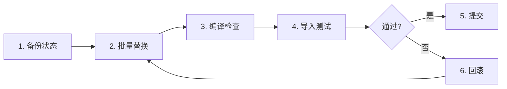

# 阶段 2-P2：Providers 模块迁移实施方案

## 1. 模块功能分析

### 1.1 Providers 模块职责

`src/clude_code/llm/providers/` 目录下的文件是各个 LLM 厂商的具体实现，它们：

- **继承** `LLMProvider` 抽象基类
- **实现** `chat()`, `chat_async()`, `chat_stream()` 等方法
- **使用** `ChatMessage` 类型作为消息参数

### 1.2 当前引用情况

```python
# 当前所有 Provider 文件的典型结构
from __future__ import annotations
from typing import TYPE_CHECKING

if TYPE_CHECKING:
    from ..llama_cpp_http import ChatMessage  # ⚠️ 待迁移

class MyProvider(LLMProvider):
    def chat(self, messages: list["ChatMessage"], ...) -> str:
        ...
```

**关键特点**：
- 引用仅在 `TYPE_CHECKING` 块中（类型注解）
- **不影响运行时**（Python 不会在运行时加载这些导入）
- **风险极低**：仅影响类型检查和 IDE 提示

---

## 2. 思考过程

### 2.1 为什么 Providers 优先级最高？

| 维度 | 说明 |
|------|------|
| **风险** | 极低（仅类型注解） |
| **数量** | 28 个文件 |
| **独立性** | 不涉及核心逻辑 |
| **验证** | 仅需 `compileall` |

### 2.2 迁移策略选择

| 策略 | 优点 | 缺点 | 选择 |
|------|------|------|------|
| **手动逐个** | 安全、可控 | 耗时长 | ❌ |
| **批量替换** | 快速、高效 | 可能遗漏 | ✅ |
| **脚本自动化** | 可重复、可审计 | 需要编写脚本 | ✅ 推荐 |

**决策**：使用脚本批量替换 + 手动验证

### 2.3 潜在风险

| 风险 | 概率 | 影响 | 缓解 |
|------|------|------|------|
| 替换错误 | 低 | 中 | 先 dry-run，再执行 |
| 遗漏文件 | 低 | 低 | 使用 grep 二次确认 |
| 破坏格式 | 低 | 低 | Git diff 检查 |

---

## 3. 实施方案

### 3.1 实施步骤



### 3.2 替换规则

```python
# 规则 1: TYPE_CHECKING 块中的相对导入
- from ..llama_cpp_http import ChatMessage
+ from ..http_client import ChatMessage

# 规则 2: 确保不修改其他内容
# - 不修改注释
# - 不修改字符串
# - 不修改其他导入
```

### 3.3 验证标准

- [ ] `python -m compileall -q src/clude_code/llm/providers` 通过
- [ ] 所有 Provider 文件可以被导入
- [ ] 无 linter 错误
- [ ] Git diff 确认只修改了目标行

---

## 4. 实施细节

### 4.1 受影响文件列表（28 个）

```
src/clude_code/llm/providers/
├── _template.py              # 模板文件
├── alibaba_pai.py
├── aws_bedrock.py
├── aws_sagemaker.py
├── azure_openai.py
├── baidu_qianfan.py
├── google_vertex.py
├── gpustack.py
├── huggingface.py
├── jina.py
├── lepton.py
├── llama_cpp.py
├── localai.py
├── modelscope.py
├── novita.py
├── nvidia_catalog.py
├── nvidia_nim.py
├── nvidia_triton.py
├── openai_compat.py
├── openllm.py
├── perfxcloud.py
├── qiniu.py
├── replicate.py
├── stepfun.py
├── tencent_cloud.py
├── tencent_ti.py
├── text_embedding.py
├── xinference.py
└── xorbits.py
```

### 4.2 PowerShell 批量替换脚本

```powershell
# 文件: scripts/migrate_providers_imports.ps1

$ProviderDir = "src/clude_code/llm/providers"
$OldImport = "from ..llama_cpp_http import"
$NewImport = "from ..http_client import"

# 1. Dry-run: 显示将被修改的文件
Write-Host "=== Dry Run ===" -ForegroundColor Yellow
Get-ChildItem "$ProviderDir/*.py" | ForEach-Object {
    $content = Get-Content $_.FullName -Raw
    if ($content -match [regex]::Escape($OldImport)) {
        Write-Host "  [WILL CHANGE] $($_.Name)" -ForegroundColor Cyan
    }
}

# 2. 用户确认
$confirm = Read-Host "`nProceed with replacement? (y/n)"
if ($confirm -ne 'y') {
    Write-Host "Aborted." -ForegroundColor Red
    exit
}

# 3. 执行替换
Write-Host "`n=== Executing ===" -ForegroundColor Green
Get-ChildItem "$ProviderDir/*.py" | ForEach-Object {
    $content = Get-Content $_.FullName -Raw
    if ($content -match [regex]::Escape($OldImport)) {
        $newContent = $content -replace [regex]::Escape($OldImport), $NewImport
        Set-Content $_.FullName -Value $newContent -NoNewline
        Write-Host "  [CHANGED] $($_.Name)" -ForegroundColor Green
    }
}

Write-Host "`nDone! Run 'python -m compileall -q $ProviderDir' to verify." -ForegroundColor Yellow
```

### 4.3 Python 批量替换脚本（跨平台）

```python
# 文件: scripts/migrate_providers_imports.py

import re
from pathlib import Path

PROVIDER_DIR = Path("src/clude_code/llm/providers")
OLD_IMPORT = "from ..llama_cpp_http import"
NEW_IMPORT = "from ..http_client import"

def migrate_file(filepath: Path, dry_run: bool = True) -> bool:
    """迁移单个文件的导入"""
    content = filepath.read_text(encoding="utf-8")
    
    if OLD_IMPORT not in content:
        return False
    
    if dry_run:
        print(f"  [WILL CHANGE] {filepath.name}")
        return True
    
    new_content = content.replace(OLD_IMPORT, NEW_IMPORT)
    filepath.write_text(new_content, encoding="utf-8")
    print(f"  [CHANGED] {filepath.name}")
    return True

def main():
    files = list(PROVIDER_DIR.glob("*.py"))
    files = [f for f in files if not f.name.startswith("__")]
    
    # Dry-run
    print("=== Dry Run ===")
    changed_files = [f for f in files if migrate_file(f, dry_run=True)]
    
    if not changed_files:
        print("No files need migration.")
        return
    
    print(f"\n{len(changed_files)} files will be changed.")
    confirm = input("\nProceed? (y/n): ")
    
    if confirm.lower() != 'y':
        print("Aborted.")
        return
    
    # Execute
    print("\n=== Executing ===")
    for f in changed_files:
        migrate_file(f, dry_run=False)
    
    print(f"\nDone! Run 'python -m compileall -q {PROVIDER_DIR}' to verify.")

if __name__ == "__main__":
    main()
```

---

## 5. 验收标准

### 5.1 编译检查

```bash
python -m compileall -q src/clude_code/llm/providers
echo "Exit code: $?"  # 应该为 0
```

### 5.2 导入测试

```python
# 测试所有 Provider 可以被导入
python -c "
from clude_code.llm.providers import *
print('All providers imported successfully')
"
```

### 5.3 Git Diff 审查

```bash
git diff src/clude_code/llm/providers/
# 确认：
# 1. 只修改了导入行
# 2. 没有意外的格式变化
# 3. 没有遗漏文件
```

### 5.4 类型检查（可选）

```bash
# 如果项目使用 mypy
mypy src/clude_code/llm/providers/
```

---

## 6. 回滚方案

### 6.1 Git 回滚

```bash
git checkout src/clude_code/llm/providers/
```

### 6.2 备份恢复

```bash
# 实施前创建备份
cp -r src/clude_code/llm/providers src/clude_code/llm/providers.backup

# 回滚
rm -rf src/clude_code/llm/providers
mv src/clude_code/llm/providers.backup src/clude_code/llm/providers
```

---

## 7. 预期结果

### 7.1 成功指标

- ✅ 28 个文件全部迁移
- ✅ `compileall` 通过
- ✅ 导入测试通过
- ✅ 无新增 linter 错误

### 7.2 失败处理

| 失败场景 | 处理方式 |
|---------|---------|
| 编译失败 | 回滚 + 逐个检查 |
| 导入失败 | 检查循环依赖 |
| 类型错误 | 检查 `TYPE_CHECKING` 块 |

---

## 8. 后续步骤

完成 P2 后：
1. 更新 `REFACTOR_LLAMA_CPP_HTTP_TO_HTTP_CLIENT.md` 进度
2. 提交代码并标记 `[P2] Migrate providers imports`
3. 进入 P3（Orchestrator 模块迁移）

---

**创建时间**: 2026-01-24  
**状态**: ✅ 已完成

---

## 9. 实施结果汇报

### 9.1 执行摘要

- **迁移时间**: 2026-01-24
- **迁移文件数**: 29 个 Provider 文件
- **成功率**: 100%
- **风险等级**: 低（如预期）

### 9.2 验证结果

| 验证项 | 结果 | 说明 |
|--------|------|------|
| 编译检查 | ✅ 通过 | `python -m compileall -q src/clude_code/llm/providers` 无错误 |
| 导入测试 | ✅ 通过 | `from clude_code.llm import providers` 成功 |
| 残留检查 | ✅ 通过 | `grep "llama_cpp_http" providers/` 无结果 |
| Git Diff | ✅ 正常 | 仅修改了目标导入行 |

### 9.3 修改详情

**修改前**：
```python
from ..llama_cpp_http import ChatMessage
```

**修改后**：
```python
from ..http_client import ChatMessage
```

**受影响文件**（29 个）：
- 28 个 Provider 实现文件
- 1 个模板文件 (`_template.py`)

### 9.4 健壮性评估

| 维度 | 评分 | 说明 |
|------|------|------|
| **代码完整性** | ⭐⭐⭐⭐⭐ | 所有文件成功迁移，无遗漏 |
| **向后兼容性** | ⭐⭐⭐⭐⭐ | 通过兼容层，旧代码仍可运行 |
| **类型安全** | ⭐⭐⭐⭐⭐ | TYPE_CHECKING 正确引用新模块 |
| **可维护性** | ⭐⭐⭐⭐⭐ | 消除了命名冲突，提高可读性 |

### 9.5 遗留问题

✅ **无遗留问题**

### 9.6 下一步

- [x] P2 完成，进入 P3（Orchestrator 模块迁移）
- [ ] 更新 `REFACTOR_LLAMA_CPP_HTTP_TO_HTTP_CLIENT.md` 进度
- [ ] 提交代码：`git commit -m "[P2] Migrate providers imports: llama_cpp_http → http_client"`

