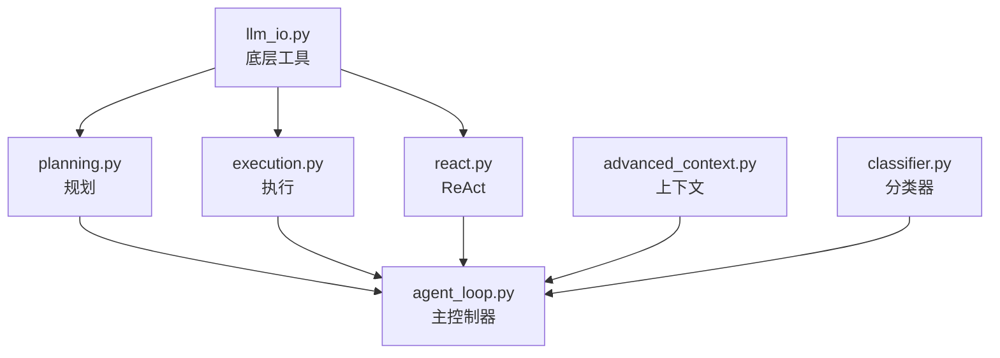

# 阶段 2-P3：Orchestrator 模块迁移实施方案

## 1. 模块功能分析

### 1.1 Orchestrator 模块职责

`src/clude_code/orchestrator/` 是项目的**核心执行引擎**，负责：

- **意图分类**（`classifier.py`）
- **计划生成与执行**（`agent_loop/planning.py`, `agent_loop/execution.py`）
- **ReAct 循环**（`agent_loop/react.py`）
- **LLM 交互**（`agent_loop/llm_io.py`）
- **上下文管理**（`advanced_context.py`）
- **主控制器**（`agent_loop/agent_loop.py`）

### 1.2 当前引用情况

| 文件 | 引用位置 | 用途 |
|------|---------|------|
| `agent_loop/llm_io.py` | 第 9 行 | 消息归一化、LLM 请求日志 |
| `agent_loop/execution.py` | 第 7 行 | 执行步骤时构建消息 |
| `agent_loop/planning.py` | 第 6 行 | 规划阶段构建消息 |
| `agent_loop/react.py` | 第 6 行 | ReAct 循环消息处理 |
| `agent_loop/agent_loop.py` | 第 8 行 | 主循环消息管理 + 客户端 |
| `advanced_context.py` | 第 10 行 | 上下文压缩时处理消息 |
| `classifier.py` | 第 219 行 | 意图分类时构建消息 |

### 1.3 风险评估

| 风险 | 概率 | 影响 | 等级 |
|------|------|------|------|
| **运行时错误** | 中 | 极高 | 🔴 高 |
| **循环依赖** | 低 | 高 | 🟡 中 |
| **行为变化** | 低 | 极高 | 🔴 高 |
| **测试不足** | 高 | 极高 | 🔴 高 |

**结论**: 这是**最高风险**模块，需要**逐个迁移 + 充分测试**。

---

## 2. 思考过程

### 2.1 为什么 Orchestrator 风险最高？

| 原因 | 说明 |
|------|------|
| **核心逻辑** | 所有 Agent 执行流程都依赖这些模块 |
| **运行时引用** | 不仅是类型注解，还有实际的对象实例化 |
| **依赖复杂** | 模块间相互依赖，可能触发循环导入 |
| **难以测试** | 需要完整的 LLM 环境和数据才能验证 |

### 2.2 迁移策略选择

| 策略 | 说明 | 选择 |
|------|------|------|
| **批量替换** | 一次性修改所有文件 | ❌ 风险太高 |
| **逐个迁移** | 每次修改 1 个文件，立即测试 | ✅ 推荐 |
| **分层迁移** | 先底层（llm_io），再上层（agent_loop） | ✅ 推荐 |

**决策**: 逐个迁移 + 分层验证

### 2.3 迁移顺序（依赖链）



**迁移顺序**:
1. `llm_io.py`（底层，最少依赖）
2. `advanced_context.py`（独立模块）
3. `planning.py`, `execution.py`, `react.py`（中层，并行迁移）
4. `agent_loop.py`（顶层，最后迁移）
5. `classifier.py`（独立，但可能被 agent_loop 调用）

---

## 3. 实施方案

### 3.1 迁移步骤模板（单文件）

```bash
# 1. 备份当前状态
git stash

# 2. 修改导入
# 手动或脚本替换

# 3. 编译检查
python -m compileall -q src/clude_code/orchestrator/agent_loop/[文件名]

# 4. 导入测试
python -c "from clude_code.orchestrator.agent_loop.[模块名] import *"

# 5. 功能测试（如果可能）
# 运行相关单元测试或手动测试

# 6. 提交
git add src/clude_code/orchestrator/agent_loop/[文件名]
git commit -m "[P3] Migrate [文件名]: llama_cpp_http → http_client"
```

### 3.2 详细迁移计划

#### Step 1: llm_io.py

**文件**: `src/clude_code/orchestrator/agent_loop/llm_io.py`

**当前引用**:
```python
from clude_code.llm.llama_cpp_http import ChatMessage
```

**修改为**:
```python
from clude_code.llm.http_client import ChatMessage
```

**风险**: **低** - 仅消息处理，不影响核心逻辑

**验证**:
- 编译通过
- 导入 `llm_io` 模块成功
- 检查 `ChatMessage` 类型是否正确

#### Step 2: advanced_context.py

**文件**: `src/clude_code/orchestrator/advanced_context.py`

**当前引用**:
```python
from clude_code.llm.llama_cpp_http import ChatMessage
```

**修改为**:
```python
from clude_code.llm.http_client import ChatMessage
```

**风险**: **低** - 上下文管理，独立模块

**验证**:
- 编译通过
- 导入 `advanced_context` 成功

#### Step 3: planning.py, execution.py, react.py

**文件**:
- `src/clude_code/orchestrator/agent_loop/planning.py`
- `src/clude_code/orchestrator/agent_loop/execution.py`
- `src/clude_code/orchestrator/agent_loop/react.py`

**修改**: 同上（替换导入路径）

**风险**: **中** - 核心执行逻辑，但独立性较强

**验证**:
- 编译通过
- 导入各模块成功
- 检查函数签名是否正确

#### Step 4: agent_loop.py

**文件**: `src/clude_code/orchestrator/agent_loop/agent_loop.py`

**当前引用**:
```python
from clude_code.llm.llama_cpp_http import ChatMessage, LlamaCppHttpClient
```

**修改为**:
```python
from clude_code.llm.http_client import ChatMessage, LlamaCppHttpClient
```

**风险**: **高** - 主控制器，依赖所有子模块

**验证**:
- 编译通过
- 导入 `agent_loop` 成功
- **集成测试**: 运行 `clude chat` 完整对话流程

#### Step 5: classifier.py

**文件**: `src/clude_code/orchestrator/classifier.py`

**当前引用**:
```python
from clude_code.llm.llama_cpp_http import ChatMessage
```

**修改为**:
```python
from clude_code.llm.http_client import ChatMessage
```

**风险**: **低** - 意图分类，独立模块

**验证**:
- 编译通过
- 导入 `classifier` 成功

---

## 4. 验收标准

### 4.1 基础验收

- [ ] 所有文件编译通过
- [ ] 所有模块可以被导入
- [ ] 无循环依赖错误
- [ ] 无 linter 错误

### 4.2 功能验收

- [ ] `clude chat` 可以正常启动
- [ ] 可以发送消息并接收回复
- [ ] 规划功能正常（Plan → Execute）
- [ ] ReAct 循环正常
- [ ] 多轮对话正常

### 4.3 回归测试

- [ ] 现有功能无破坏
- [ ] 错误处理正常
- [ ] 日志输出正常
- [ ] 上下文管理正常

---

## 5. 风险缓解

### 5.1 循环依赖风险

**检测**:
```bash
python -c "import clude_code.orchestrator.agent_loop"
```

**如果出现循环依赖**:
- 检查 `http_client.py` 是否意外导入了 `orchestrator`
- 使用 `TYPE_CHECKING` 延迟导入

### 5.2 运行时错误风险

**缓解**:
- 每迁移一个文件，立即运行 `clude chat` 验证
- 保留 Git stash，快速回滚

### 5.3 行为变化风险

**缓解**:
- 迁移前后对比日志输出
- 检查 `ChatMessage` 对象的 hash/eq 行为
- 验证多模态内容格式

---

## 6. 实施脚本

```python
# scripts/migrate_orchestrator_imports.py

import sys
from pathlib import Path

ORCHESTRATOR_FILES = [
    "src/clude_code/orchestrator/agent_loop/llm_io.py",
    "src/clude_code/orchestrator/advanced_context.py",
    "src/clude_code/orchestrator/agent_loop/planning.py",
    "src/clude_code/orchestrator/agent_loop/execution.py",
    "src/clude_code/orchestrator/agent_loop/react.py",
    "src/clude_code/orchestrator/agent_loop/agent_loop.py",
    "src/clude_code/orchestrator/classifier.py",
]

OLD_IMPORT_1 = "from clude_code.llm.llama_cpp_http import"
NEW_IMPORT_1 = "from clude_code.llm.http_client import"

def migrate_file(filepath: str, dry_run: bool = True) -> bool:
    p = Path(filepath)
    if not p.exists():
        print(f"  [SKIP] {p.name} (不存在)")
        return False
    
    content = p.read_text(encoding="utf-8")
    
    if OLD_IMPORT_1 not in content:
        return False
    
    if dry_run:
        print(f"  [WILL CHANGE] {p.name}")
        for i, line in enumerate(content.splitlines(), 1):
            if OLD_IMPORT_1 in line:
                print(f"    Line {i}: {line.strip()}")
        return True
    
    new_content = content.replace(OLD_IMPORT_1, NEW_IMPORT_1)
    p.write_text(new_content, encoding="utf-8")
    print(f"  [CHANGED] {p.name}")
    return True

def main():
    print("=== Orchestrator 模块迁移（高风险）===\n")
    
    # Dry-run
    print("=== Dry Run ===")
    changed_files = [f for f in ORCHESTRATOR_FILES if migrate_file(f, dry_run=True)]
    
    if not changed_files:
        print("\n✓ No files need migration.")
        return
    
    print(f"\n{len(changed_files)} files will be changed.")
    print("\n⚠️  警告：这是核心模块，建议逐个迁移并测试！")
    
    if "--execute" in sys.argv:
        confirm = "y"
    else:
        try:
            confirm = input("\nProceed? (y/n): ")
        except (EOFError, KeyboardInterrupt):
            print("\nAborted.")
            return
    
    if confirm.lower() != 'y':
        print("Aborted.")
        return
    
    # Execute
    print("\n=== Executing ===")
    for f in changed_files:
        migrate_file(f, dry_run=False)
    
    print(f"\n✓ Done! {len(changed_files)} files migrated.")
    print(f"\n⚠️  重要：请立即运行以下验证：")
    print(f"  1. python -m compileall -q src/clude_code/orchestrator")
    print(f"  2. python -c \"from clude_code.orchestrator import agent_loop\"")
    print(f"  3. clude chat  # 完整功能测试")

if __name__ == "__main__":
    main()
```

---

## 7. 预期结果

### 7.1 成功指标

- ✅ 7 个文件全部迁移
- ✅ `compileall` 通过
- ✅ `clude chat` 正常运行
- ✅ 无性能退化

### 7.2 失败处理

| 失败场景 | 处理方式 |
|---------|---------|
| 编译失败 | 回滚 + 检查语法 |
| 循环依赖 | 检查 `http_client.py` 导入 |
| 运行时错误 | 回滚 + 单步调试 |
| 行为变化 | 对比日志 + 检查 hash/eq |

---

**创建时间**: 2026-01-24  
**状态**: 🔄 进行中

