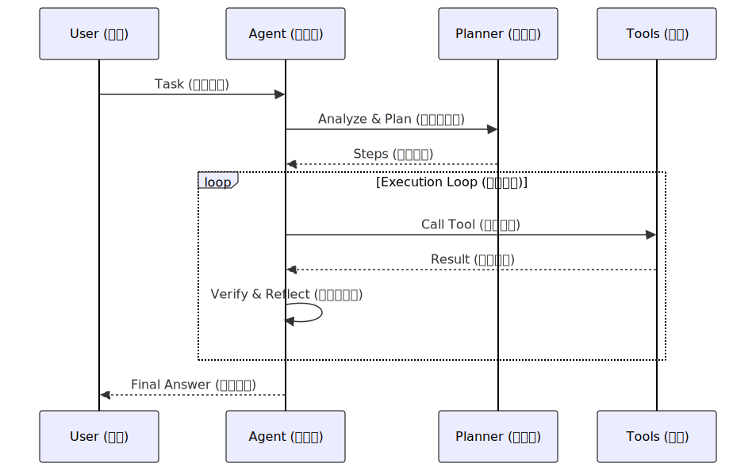
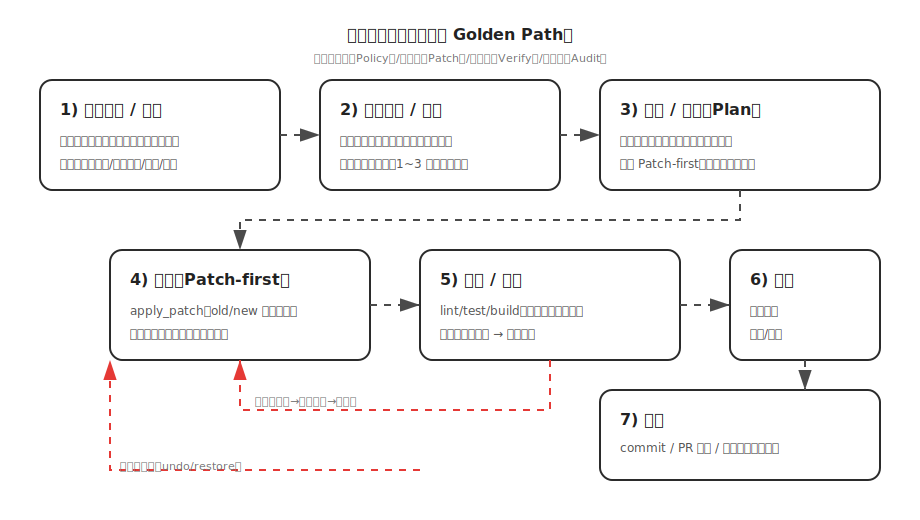
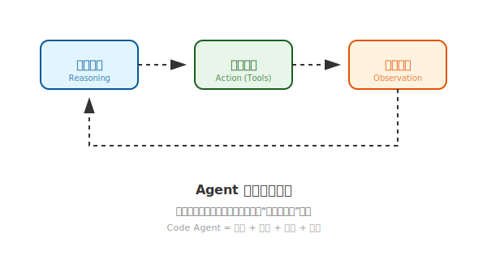

# 业界 Code Agent 技术原理深度白皮书 (Technical Whitepaper)

> **Status (状态)**: Final (定稿)  
> **Topic (主题)**: Technical Architecture & Industry Benchmarking (技术架构与业界对标)

本白皮书深入探讨 Code Agent 的核心技术挑战、主流路线实现原理，并定义当前业界公认的“最佳技术路径”。

---

## 0. 评估框架与分析流程 (Assessment Framework)

本章定义“如何做业界技术对标与打分”，避免只停留在概念对比。

### 0.1 对标对象 (Benchmarking Targets)
- **CLI Agent**: Claude Code, Aider (强调终端/仓库内闭环)
- **IDE Agent**: Cursor (强调编辑器深度集成与高质量检索)
- **AgentOS/Platform**: OpenDevin (强调多工具、多进程、回放/评测)

### 0.2 打分维度 (Scoring Dimensions)

> 评分含义：**不是“模型能力”评分，而是“工程系统能力”评分**。

1. **编排与状态机 (Orchestration & State Machine)**：是否有显式 Plan、步骤状态、失败恢复 (Retry/Rollback/Replan)。
2. **编辑精度 (Editing Precision)**：是否以 Patch/Search-Replace 为主，是否具备冲突处理与可回滚。
3. **检索与仓库理解 (Retrieval & Repo Understanding)**：grep + Vector + Symbol/LSP + Repo Map 的组合成熟度。
4. **验证闭环 (Verification Loop)**：Lint/Test/Build 是否自动化；失败摘要是否结构化；是否能自愈。
5. **安全与权限 (Security & Policy)**：路径沙箱 (Sandbox)、命令策略 (Policy)、网络/凭据治理、确认机制。
6. **可观测与可回放 (Observability & Replay)**：审计日志 (Audit Log)、Trace、回放包、评测与对比。
7. **UX 与可控性 (UX & Controllability)**：计划可见、工具调用可见、风险提示、可中断/可续跑。
8. **扩展与生态 (Extensibility & Ecosystem)**：工具插件化、Schema 版本、企业策略下发。

---

## 1. 核心技术架构分析 (Core Architecture Analysis)

Code Agent 的本质是 **LLM 驱动的闭环控制系统**。其核心循环遵循 **Reasoning (推理) -> Acting (行动) -> Observing (观测)**。

### 1.1 系统架构图

*(注：系统分层展示了从交互到编排再到执行的完整拓扑)*

### 1.2 核心组件原理
1.  **Planner (规划器)**: 将模糊需求 (如 "Fix the auth bug") 拆解为原子任务列表。
2.  **Context Engine (上下文引擎)**: 决定哪些代码片段、文档、报错信息进入 LLM 的 Context Window。
3.  **Tooling (工具集)**: 对 FS (文件系统)、Terminal、Git、LSP 进行安全封装。
4.  **Verification Loop (验证闭环)**: 自动化运行单元测试或静态分析。

---

## 2. 技术难度与痛点 (Technical Difficulties)

### 2.1 精确代码编辑 (The Editing Precision Problem)
-   **难度**: LLM 在重写长文件时，极易产生随机的字符丢失或逻辑错位。
-   **痛点**: 全量重写消耗 Token 巨大，且 128k 窗口也无法保证长会话的稳定性。
-   **解决方案**: 必须采用 **Unified Diff (统一差异格式)** 或 **Search-Replace Blocks** 协议，只交换改动块。

### 2.2 上下文召回率 vs 干扰 (Recall vs. Noise)
-   **难度**: 给 LLM 太多代码，它会迷失；给太少，它会由于信息缺失产生 **Hallucination (幻觉)**。
-   **难点**: 跨文件符号调用 (Cross-file Symbol References) 的动态追踪。

### 2.3 执行边界与安全 (Sandbox & Safety)
-   **难度**: Agent 需要执行 `pip install` 或 `rm` 来修复环境，但必须防止其逃逸或破坏用户系统。

---

## 3. 业界方案能力评分 (Industry Capability Scoring)

> 说明：分数体现“系统工程成熟度”，不同产品在形态与目标用户上有差异。

| 维度 | Claude Code (CLI) | Aider (CLI) | Cursor (IDE) | 结论要点 |
|---|---:|---:|---:|---|
| **编排与状态机** | 7 | 6 | 6 | Claude Code 更偏“探索式工具驱动” |
| **编辑精度** | 7 | **9** | 8 | Aider 的 Patch 机制最稳 |
| **检索与仓库理解** | 7 | 7 | **9** | IDE 场景天然具备索引/LSP/RAG 集成优势 |
| **验证闭环** | 7 | 6 | 6 | 真实工程里验证闭环往往需要用户环境配合 |
| **安全与权限** | 7 | 6 | 7 | CLI 的命令执行风险更高，必须强 Policy |
| **可观测与回放** | 6 | 5 | 6 | 业界普遍欠缺“回放/评测”产品化 |
| **UX 与可控性** | 7 | 7 | **9** | IDE 的可视化显著提升可控性 |
| **扩展与生态** | 6 | 6 | 7 | IDE 插件生态强 |

### 结论
- **编辑精度是第一性问题**: 没有 Patch 机制的 Agent 很难工程化。
- **IDE 的优势来自“上下文与可视化”**: 不是模型更强，而是索引/LSP/编辑器能力加成。
- **CLI 的优势来自“可控执行 + 可治理”**: 更容易做本地/内网落地与审计。

---

## 4. 实现原理流程图 (Implementation Flow)

### 4.1 最佳实践流程：Plan-Execute-Verify (PEV) 模式

*(注：动画演示了从用户输入、任务规划到执行自检的完整闭环)*

### 4.2 实现思考流程图（工程落地 Golden Path）

*(注：该动画图用于指导“从需求到落地”的工程实现顺序)*

---

## 5. 最佳技术路径 (The Golden Path)

### 5.1 核心公式
> **Code Agent = (Plan + ReAct) × Unified Diff × Repo Map × Verification（计划×推理行动×统一补丁×仓库映射×验证闭环）**  
> 注释：Plan=计划，ReAct=推理+行动，Unified Diff=统一补丁，Repo Map=仓库映射，Verification=验证闭环

### 5.2 技术细节要求
1.  **编辑协议**: 使用 **Search-Replace Block** 协议。
2.  **上下文策略**: **Repo Map (仓库映射)**。在发送代码前，先发送一个包含全局类名、函数名的精简拓扑。
3.  **编排架构**: **两级状态机 (Two-Level State Machine)**。
    -   **L1 (Manager)**: 负责维护全局 Todo List。
    -   **L2 (Worker)**: 负责具体的原子工具调用与报错修复。
4.  **自愈能力**: 必须将 **LSP (Language Server Protocol)** 和 **Test Runner** 作为一等公民集成。

### 5.3 最佳技术路径（工程落地版结论）

1. **Patch-first 编辑**: 默认 Patch/Search-Replace，拒绝整文件重写。
2. **RAG + Repo Map + (可选) LSP**: 先全局符号/仓库地图，再精确片段注入。
3. **Verify-first 闭环**: 每次关键修改后触发 Lint/Test/Build。
4. **Policy-first 安全治理**: 路径、命令、网络、凭据、确认分级与审计。
5. **Replay-first 可回放评测**: 工具调用序列与 Patch 可回放。

---

## 6. 原理图 (Reasoning Loop)

---

## 7. 与本项目映射 (Mapping to Clude Code)

- **Patch-first 编辑**: ✅ 已落地 (`apply_patch` 支持多处/全量替换与可选 Fuzzy)
- **工具调用解析鲁棒性**: ✅ 已增强
- **Policy-first**: ✅ 已具备 (Sandbox + Policy)
- **Audit**: ✅ 已具备 (Audit Log + Hash)
- **Verify-first**: ✅ 已落地（已接入 `verification/`，在执行后按修改文件触发 `run_verify`）
- **Repo Map / RAG / LSP**: ✅ 已落地

> 对标业界稳健性的下一步落地点：**结构化工具回喂 + rg 搜索**。
