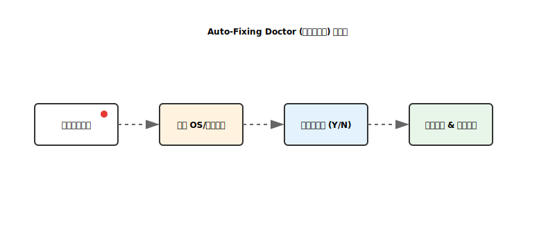

# 业界级增强实现分析：Auto-Fixing Doctor (交互式修复)

本项目已实现 `clude doctor --fix` 功能，旨在降低用户配置环境的门槛，实现“分钟级”环境对齐。

---

## 1. 核心设计 (Core Design)

实现位置：`src/clude_code/cli/main.py::doctor` & `_try_fix_missing_tools`

### 1.1 依赖探测矩阵
系统会扫描核心依赖链：
- **ripgrep (rg)**：用于高性能搜索。
- **universal-ctags**：用于构建 Repo Map。

### 1.2 跨平台修复引擎
采用“探测-映射-执行”模式：
1. **OS 探测**：识别 `Windows`, `Darwin (Mac)`, `Linux`。
2. **包管理器优先级**：
   - **Windows**：`Conda` > `Choco` > `Scoop`。
   - **Mac**：`Homebrew`。
   - **Linux**：`apt-get` (基于 Debian 系)。
3. **命令模板化**：将缺失工具列表动态注入安装命令。

---

## 2. 安全与交互原则

- **显式确认 (Explicit Consent)**：系统严禁在未经用户许可的情况下执行 `sudo` 或安装命令。所有修复操作必须通过 `Confirm.ask`。
- **闭环验证 (Closed-loop Verification)**：修复操作完成后，系统会自动重新运行 `doctor` 检查逻辑，确保修复确实生效。
- **非破坏性**：仅安装缺失的二进制工具，不修改用户已有的配置文件。

---

## 3. 局限性与改进空间

- **Linux 多样性**：目前仅适配了 `apt-get`。对于 `yum` 或 `pacman` 用户，仍需手动安装。
- **权限边界**：在某些受限环境下，安装命令可能失败。
  - *后续优化*：提供离线二进制下载链接或静态编译包。

---

## 4. 结论与进度

- **状态**：✅ 已落地
- **效果**：极大减少了新手用户在“为什么 Agent 找不到符号”上的排障时间。

