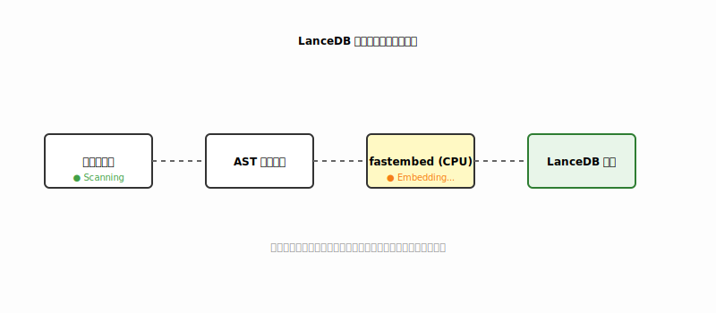

# LanceDB 后台异步全量索引实现分析 (Lancedb Indexing Analysis)

本文件详细描述了如何在 clude-code 中落地大规模向量检索系统，同时保证不影响主进程的对话流畅度。

---

## 1. 核心流程分析 (Implementation Flow)

### 1.1 扫描阶段 (Discovery)
- **输入**：`workspace_root`。
- **逻辑**：递归遍历所有文件，跳过 `.gitignore`、`.git`、`node_modules`、`.venv` 等。
- **指纹校验**：为每个文件记录 `mtime` 和 `size`。如果指纹未变，则跳过后续的 Chunk 和 Embedding 步骤。

### 1.2 分块阶段 (Chunking)
- **策略**：固定长度与逻辑边界相结合。
- **逻辑**：优先按行切分，保证每块约 500-1000 字符，重叠（Overlap）10%。
- **元数据绑定**：每个 Chunk 必须携带 `path`, `start_line`, `end_line`, `hash`。

### 1.3 向量化阶段 (Embedding)
- **难点**：**算力竞争隔离**：在本地运行 `llama.cpp` 时，CPU 通常处于高负载。如果全速运行 `fastembed`，会导致系统假死或对话卡顿。
- **对策**：使用 `ProcessPoolExecutor` 并限制 Workers 数量为 1，或者使用低优先级（Low Priority）线程。

### 1.4 写入阶段 (Persistence)
- **引擎**：LanceDB。
- **逻辑**：将向量与元数据批量写入 `.clude/index/code_vectors.lance`。

---

## 2. 异步编排设计 (Async Orchestration)

### 2.1 生产者-消费者模型
1. **Producer (File Watcher)**：启动时全量扫描，随后监听文件系统变动（watchdog）。
2. **Task Queue**：待向量化的文件队列。
3. **Consumer (Worker)**：后台线程每隔 5 秒检查队列，批量处理 Embedding 任务。

### 2.2 状态感知
- 向用户展示“索引进度条”（例如：`[Indexing: 450/1200 files]`）。
- 难点：**读写冲突保护**：Agent 在执行语义搜索时，如果后台正在写入新的索引块，必须确保 LanceDB 的 ACID 特性能够保证读取的是一致的快照。

---

## 3. 详细实现思路 (Coding Plan)

### 3.1 新增模块 `src/clude_code/knowledge/`
- `vector_store.py`: 封装 LanceDB 的连接、创建 Table 和搜索逻辑。
- `embedder.py`: 封装 fastembed 调用。
- `indexer_service.py`: 负责后台线程的循环调度。

### 3.2 接入 `AgentLoop`
- 初始化时静默启动 `IndexerService`。
- 新增内部方法 `self._semantic_search(query)`：在 Agent 思考前自动检索相关的 Top-5 代码片段并注入。

---

## 4. 风险控制

- **磁盘空间**：对于超大仓库，索引文件可能占用数百 MB。
  - *策略*：提供 `clude index clean` 命令清理过期索引。
- **冷启动**：首次运行耗时。
  - *策略*：先让用户进入对话，后台慢慢建索引，而不是强制等待。

---

## 5. 结论

- **状态**：✅ 已落地 (MVP)
- **核心组件**：
  - `VectorStore`: 基于 LanceDB 的持久化存储。
  - `CodeEmbedder`: 基于 fastembed 的本地 CPU 向量化。
  - `IndexerService`: 后台异步扫描线程。
- **效果**：Agent 现在具备 `search_semantic` 工具，能够跨越文件边界定位模糊的业务逻辑。

