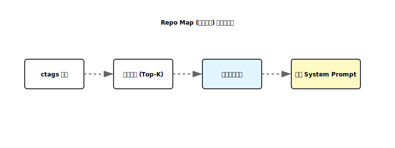

# 业界级增强实现分析：Repo Map (符号拓扑)

本项目已成功落地对标 Aider 的 `Repo Map` 能力。本文件记录其实现细节、核心逻辑与风险控制。

---

## 1. 核心逻辑 (Core Logic)

实现位置：`src/clude_code/tooling/local_tools.py::generate_repo_map`

### 1.1 符号提取流程
1. **探测工具**：使用 `shutil.which("ctags")` 查找 `universal-ctags`。
2. **扫描策略**：
   - 采用递归扫描模式 (`-R .`)。
   - 显式指定主流开发语言：`Python, JavaScript, TypeScript, Go, Java, Rust, C, C++, C#`。
   - 使用 JSON 输出格式 (`--output-format=json`)，便于程序精确解析。
3. **噪音过滤**：
   - 只保留 `class`, `function`, `method`, `member`, `interface`, `struct` 等高权重符号。
   - 过滤局部变量、导入语句等对理解架构无意义的噪音。

### 1.2 地图构建 (Map Construction)
- **按文件组织**：将符号归类到所属文件下。
- **精简展示**：
  - 每个文件限制展示前 15 个符号。
  - 全局限制展示前 100 个文件。
  - 使用紧凑格式：`[类型缩写]| [符号名] (行号)`。

---

## 2. 动态注入机制

实现位置：`src/clude_code/orchestrator/agent_loop.py`

在 `AgentLoop` 初始化时，系统会自动生成 Repo Map，并将其作为一条额外的 **`system message`** 插入对话流头部。这意味着：
- **零成本感知**：模型在处理用户第一条指令时，就已经知道了 `AgentLoop` 类在哪个文件，`apply_patch` 函数长什么样。
- **路径对齐**：地图中的所有路径都是基于工作区根目录的，模型可以直接引用这些路径进行 `read_file`。

---

## 3. 风险与优化点

- **性能损耗**：对于超大规模仓库（10万+文件），同步运行 `ctags` 可能有秒级延迟。
  - *后续优化*：改为后台异步生成或使用持久化缓存（`.clude/cache/tags`）。
- **依赖性**：强依赖 `universal-ctags` 二进制文件。
  - *处理*：在 `doctor` 中增加了安装引导，且在代码中做了平滑降级处理（找不到则提示功能受限）。

---

## 4. 结论与进度

- **状态**：✅ 已落地
- **效果**：极大地增强了 Agent 的“全局搜索速度”和“架构理解深度”，减少了盲目 `grep` 的次数。

