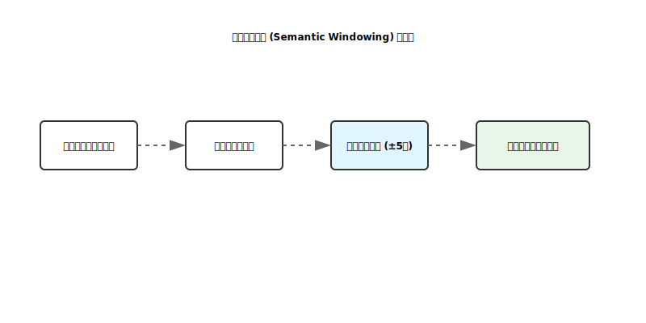

# 业界级增强实现分析：语义窗口采样 (Semantic Windowing)

本项目已实现轻量级语义回喂优化，通过“意图感知”的采样算法，确保回喂给模型的内容始终包含用户关注的核心上下文。

---

## 1. 核心算法 (Algorithm)

实现位置：`src/clude_code/tooling/feedback.py::summarize_tool_result`

### 1.1 关键词提取 (Keyword Extraction)
- **触发点**：每回合用户输入 (`run_turn`)。
- **逻辑**：使用正则提取 4 字符以上的长单词，并过滤掉常见的操作指令（如 "please", "find" 等），识别出用户真正的“意图实体”（如具体的类名或变量名）。

### 1.2 窗口采样逻辑
当处理 `read_file` 的结果时：
1. **行扫描**：在文件的每一行中搜索关键词命中。
2. **动态窗口**：对每个命中行，提取其前后各 5 行（共 11 行）作为一个“语义窗口”。
3. **区域合并**：如果两个关键词距离很近，系统会自动合并重叠的窗口，避免重复。
4. **回喂构造**：使用 `--- lines X-Y ---` 标记清晰地告知模型该片段在文件中的具体位置。

---

## 2. 业界对比 (Cursor vs. Clude-Code)

- **Cursor (RAG)**：在大规模文本上使用 Embedding 和向量数据库。
- **Clude-Code (Windowing)**：在单个文件或工具输出内部，采用关键词驱动的精准采样。
- **权衡**：我们的做法**延迟几乎为零**，不需要额外的内存存储索引，非常适合在 CPU 环境下配合 `llama.cpp` 使用。

---

## 3. 风险与优化点

- **关键词冲突**：如果用户输入很短（如 "Fix bug"），可能提取不到有效关键词。
  - *降级处理*：系统会自动回退到“头尾采样”模式，确保模型依然能看到文件的基本结构。
- **上下文截断**：最终采样结果仍受 4000 字符硬限制，以防止 Token 爆炸。

---

## 4. 结论与进度

- **状态**：✅ 已落地
- **效果**：模型在处理 1000 行以上的长文件时，能够更精准地定位到用户想要修改的特定函数块，极大提升了 `apply_patch` 的一次性成功率。

