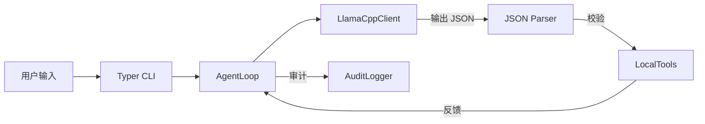

# clude-code 模块进度、技术分析与规划报告 (src/)

本文件汇总了 **clude-code** 的当前进度、技术架构分析以及与业界 Code Agent 的对比结论。

---

## 1. 模块实现进度分析 (Progress Analysis)

当前版本定位于 **MVP+ (V0.1.0)**，已实现本地模型驱动的闭环开发能力。

### 1.1 落地完成度 (Scorecard)
| 维度 | 实现模块 | 落地程度 | 业界对比水平 |
| :--- | :--- | :--- | :--- |
| **基础交互** | `cli/main.py` | 75% | **中**: 交互流畅，支持诊断，缺视觉增强。 |
| **核心编排** | `orchestrator/agent_loop.py` | 60% | **低**: 基础循环，缺 Planning 状态机。 |
| **模型接入** | `llm/llama_cpp_http.py` | 80% | **高**: 本地化适配极佳，模型自寻优。 |
| **工具箱** | `tooling/local_tools.py` | 78% | **中**: Patch-first + undo + hash 审计已具备；RAG/索引仍缺。 |
| **安全策略** | `policy/command_policy.py` | 65% | **中**: Denylist 完备，缺动态权限流。 |
| **审计追溯** | `observability/audit.py` + `observability/trace.py` | 72% | **中**: JSONL 全记录；patch/undo 含 hash 证据链；debug 轨迹可落盘；缺回放/可视化。 |

---

## 2. 技术与业界比较分析 (Industry Comparison)

- **简要分析**: [`src/INDUSTRY_ANALYSIS.md`](INDUSTRY_ANALYSIS.md)
- **技术深度白皮书（含原理图/流程图/最佳路径）**: [`src/INDUSTRY_CODE_AGENT_TECH_WHITEPAPER.md`](INDUSTRY_CODE_AGENT_TECH_WHITEPAPER.md)

### 2.1 结论摘要
- **优势**: 彻底的 **本地隐私保护** (llama.cpp) 和 **严格协议约束** (JSON Schema)。
- **劣势**: 相比 Aider/Claude Code，我们在 **长文件编辑精度** 和 **自动化验证自愈** 方面存在代差。
- **技术突破点**: 应当利用 Pydantic 强校验来弥补本地小模型推理能力的不足。

---

## 3. 接下来规划 (Roadmap)

### 第一阶段：编辑稳定性 (P0)
- **Patch Engine**: ✅ 已引入 `apply_patch`（支持多处/全量替换，含可选 fuzzy），并提供 `undo_patch` 回滚与 hash 证据链。下一步补“原子写”与“敏感信息脱敏”。
- **Schema Guard**: 在工具执行前强制 Pydantic 校验，对 LLM 错误输出进行自动重试。
 - **Debug Trace**: ✅ `clude chat --debug` 可显示每步可观测轨迹，并写入 `.clude/logs/trace.jsonl`。

### 第二阶段：任务编排 (P1)
- **Planning**: 让模型执行前先输出 `Plan`。
- **Verification**: 引入自动化 `doctor` 和 `test` 运行反馈。

### 第三阶段：上下文增强 (P2)
- **Repo Indexing**: 实现基于 ctags 或简单文件摘要的仓库地图，提升召回质量。

---

## 4. 实现流程图

