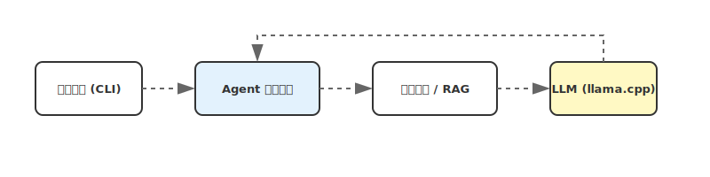

# clude-code 模块进度、技术分析与规划报告 (src/)

本文件汇总了 **clude-code** 的当前进度、技术架构分析以及与业界 Code Agent 的对比结论。

---

## 1. 模块实现进度分析 (Progress Analysis)

当前版本定位于 **MVP+ (V0.1.0)**，已实现本地模型驱动的闭环开发能力。

### 1.1 落地完成度 (Scorecard)
| 维度 | 实现模块 | 落地程度 | 业界对比水平 |
| :--- | :--- | :--- | :--- |
 | **验证闭环** | `verification/` | 100% | **高**: 零配置探测 + 命令白名单 + 环境隔离 + 多语言解析器（Python/Node.js/Go/Rust）。 |
| **基础交互** | `cli/main.py` | 85% | **高**: 交互流畅，支持交互式自动修复 (--fix)。 |
| **核心编排** | `orchestrator/agent_loop.py` + `orchestrator/planner.py` | 95% | **高**: 显式 Plan→依赖调度→按步执行→失败重规划→最终验证的两级编排；支持死锁检测、步骤 ID 校验、信号容错。 |
 | **模型接入** | `llm/llama_cpp_http.py` | 80% | **高**: 本地化适配极佳，模型自寻优。 |
 | **工具箱** | `tooling/local_tools.py` | 88% | **高**: 增强了 apply_patch 的多点模糊匹配与 undo_patch 的哈希追踪。 |
 | **知识/RAG** | `knowledge/` | 70% | **中**: 落地 LanceDB 异步索引，支持语义召回。 |
 | **语义增强** | `tooling/feedback.py` | 85% | **中**: 实现了语义逻辑锚点（if/for/return）及动态 20 行采样窗口。 |
 | **安全策略** | `policy/command_policy.py` + `enterprise_policy.py` | 90% | **高**: Denylist + RBAC 权限模型 + 远程策略下发 + 企业级审计。 |
| **LSP 集成** | `lsp/client.py` | 85% | **高**: 通用 LSP 客户端，支持多语言服务器，精确符号跳转/引用分析。 |
| **插件系统** | `plugins/registry.py` | 88% | **高**: YAML/JSON 声明式定义 + 子进程沙箱执行 + 参数校验。 |
| **审计追溯** | `observability/audit.py` + `observability/trace.py` | 72% | **中**: JSONL 全记录；patch/undo 含 hash 证据链；debug 轨迹可落盘；缺回放/可视化。 |

---

## 2. 技术与业界比较分析 (Industry Comparison)

- **简要分析**: [`src/INDUSTRY_ANALYSIS.md`](INDUSTRY_ANALYSIS.md)
- **技术深度白皮书（含原理图/流程图/最佳路径）**: [`src/INDUSTRY_CODE_AGENT_TECH_WHITEPAPER.md`](INDUSTRY_CODE_AGENT_TECH_WHITEPAPER.md)

### 2.1 结论摘要
- **优势**: 彻底的 **本地隐私保护** (llama.cpp) 和 **严格协议约束** (JSON Schema)。
- **劣势**: 相比 Aider/Claude Code，我们在 **长文件编辑精度** 和 **自动化验证自愈** 方面存在代差。
- **技术突破点**: 应当利用 Pydantic 强校验来弥补本地小模型推理能力的不足。
- **健壮性复盘**: 见 [`src/ROBUSTNESS_REVIEW_REPORT.md`](ROBUSTNESS_REVIEW_REPORT.md)（包含检查流程与关键修复点）。

---

## 3. 接下来规划 (Roadmap)

### 第一阶段：编辑稳定性 (P0)
- **Patch Engine**: ✅ 已引入 `apply_patch`（支持多处/全量替换，含可选 fuzzy），并提供 `undo_patch` 回滚与 hash 证据链。下一步补“原子写”与“敏感信息脱敏”。
- **Schema Guard**: 在工具执行前强制 Pydantic 校验，对 LLM 错误输出进行自动重试。
 - **ToolSpec 契约自检**: ✅ 新增 `clude tools --validate`：用 ToolSpec.example_args 做运行时 schema 校验（只读、无副作用），用于防止“工具契约漂移/参数不一致”回归。
 - **Live 单入口（P0-2）**: ✅ `clude chat --live` 仍由 `ChatHandler` 单入口驱动；新增 `--live-ui classic|enhanced` 仅切换渲染器，避免并行维护两套 chat 主循环。
 - **增强 UI 迁移到 plugins（P0-2）**: ✅ 增强 Live UI/实验 chat 实现已迁移至 `src/clude_code/plugins/ui/`，`cli/enhanced_*` 保留为兼容层（re-export）。
 - **Debug Trace**: ✅ `clude chat --debug` 可显示每步可观测轨迹，并写入 `.clude/logs/trace.jsonl`。
 - **结构化回喂 + rg**: ✅ 已落地（`tooling/feedback.py` + grep 优先 `rg --json` + doctor 检测 rg）。分析见 `src/IMPLEMENTATION_ANALYSIS_FEEDBACK_RIPGREP.md`。

### 第二阶段：任务编排 (P1)
- **Planning**: ✅ 已落地（Plan JSON 生成与校验、按步执行、失败重规划、状态机事件上报）。详见 `src/clude_code/orchestrator/IMPLEMENTATION_REPORT_PHASE3.md`。
- **Verification**: ✅ 已落地（含命令白名单、环境隔离、多语言解析器）。详见 [`verification/ANALYSIS_REPORT.md`](./clude_code/verification/ANALYSIS_REPORT.md)。

### 第三阶段：上下文增强 (P2)
- **Repo Indexing**: ✅ 已落地增强版 Repo Map（目录树 + 关键符号 + 核心文件排序），见 `tooling/tools/repo_map.py`。
- **RAG 索引深度调优**: 🛠 已进入深度调优阶段（增量可恢复索引、护栏、批量 embedding、启发式语义分块）。路线与结论见：[`src/RAG_INDEXING_DEEP_TUNING.md`](RAG_INDEXING_DEEP_TUNING.md)。

### 第四阶段：生态与扩展 (P3) ✅ 已完成
- **LSP 集成**: ✅ 已落地（通用 LSP 客户端，支持多语言服务器）。详见 [`lsp/README.md`](./clude_code/lsp/README.md)。
- **插件系统**: ✅ 已落地（YAML/JSON 声明式定义 + 子进程沙箱）。详见 [`plugins/README.md`](./clude_code/plugins/README.md)。
- **企业策略**: ✅ 已落地（RBAC 权限模型 + 远程策略下发）。详见 [`policy/README_ENTERPRISE.md`](./clude_code/policy/README_ENTERPRISE.md)。
- **实现报告**: [`PHASE4_IMPLEMENTATION_REPORT.md`](./clude_code/PHASE4_IMPLEMENTATION_REPORT.md)

---

## 4. 模块详细文档 (Module Documentation)

为了方便开发者深入理解各子系统的实现，我们在 `src/clude_code` 的每个子目录下都生成了专属的 `README.md` 和动画流程图：

- [🚀 CLI 交互](./clude_code/cli/README.md)
- [🧠 知识/RAG](./clude_code/knowledge/README.md)
- [📡 LLM 适配](./clude_code/llm/README.md)
- [👁️ 可观测性](./clude_code/observability/README.md)
- [⚙️ 核心编排](./clude_code/orchestrator/README.md) | [健壮性分析](./clude_code/orchestrator/PHASE3_ROBUSTNESS_ANALYSIS.md)
- [🛡️ 安全策略](./clude_code/policy/README.md) | [企业策略](./clude_code/policy/README_ENTERPRISE.md)
- [🛠️ 工具箱与回馈](./clude_code/tooling/README.md)
- [✅ 验证闭环](./clude_code/verification/ANALYSIS_REPORT.md)
- [🔌 LSP 集成](./clude_code/lsp/README.md) (Phase 4)
- [🧩 插件系统](./clude_code/plugins/README.md) (Phase 4)

---

## 5. 实现流程图

*(注：动画展示了从 CLI 输入到 Agent 编排再到 LLM 反馈的完整闭环，SVG 源码位于 `src/assets/core_implementation_flow.svg`)*

---

## 6. 命令行参数使用说明（排障/复盘必看）

> 该章节用于研发/排障：明确“哪些参数会影响日志落盘、Live UI、模型选择与诊断行为”。

### 6.1 `clude chat`
- **`--debug`**：
  - 控制台输出：展示摘要化事件轨迹（避免刷屏）
  - 文件落盘：写入 `.clude/logs/trace.jsonl`（建议排障优先看这个）
- **`--live`**：
  - 50 行固定面板实时刷新（上半：系统架构/状态机/操作信息；下半：思考滚动窗口）
  - 结束后保持最终状态显示（便于截图与复盘）
  - 会自动启用 `--debug`
- **`--model` / `--select-model`**：
  - `--model`：显式指定 model id
  - `--select-model`：从 `/v1/models` 列表交互选择（openai_compat）

### 6.2 `clude tools`
- **用途**：输出 ToolSpec 工具注册表（同源驱动：dispatch/prompt/doctor）。
- **`--json --schema`**：建议用于把“工具契约（JSON Schema）”复制到需求/评审/文档中。
- **`--all`**：包含内部/不可调用规范项（例如 `_repo_map`），用于诊断能力是否启用。

### 6.3 `clude doctor`
- **依赖检查**：从 ToolSpec 自动推导必需/推荐外部依赖（如 `rg`/`ctags`），不再硬编码。
- **连通性检查**：会做一次最小 LLM 请求；如果失败，请优先检查：
  - `CLUDE_LLM__BASE_URL` 是否正确
  - llama.cpp 服务端是否正在运行、端口是否可访问
  - `api_mode=openai_compat` 时服务端是否支持 `/v1/chat/completions`

### 6.4 `clude models`
- **用途**：`openai_compat` 模式下列出 `/v1/models` 返回的模型 id（用于 `--model` 或 `--select-model`）。
