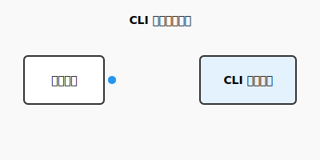

# CLI 模块

负责处理用户输入、命令分发以及与用户的交互界面。

## 核心组件
- `main.py`: 基于 Typer 的 CLI 命令入口。

## 命令行使用说明（参数与示例）

本项目的 CLI 命令入口为：`clude`。

### 1) `clude chat`：进入交互式对话（核心入口）

用于让 Agent 在本地代码仓库上执行“读文件/搜索/补丁编辑/命令执行/验证闭环”等任务。

- **参数**
  - **`--model TEXT`**：指定 llama.cpp 的 model id（当 `api_mode=openai_compat` 且服务端需要显式 model 时很有用）
  - **`--select-model`**：启动时调用 `/v1/models` 获取列表并交互选择（仅对 `openai_compat` 有意义）
  - **`--debug`**：输出可观测执行轨迹（并写入 `.clude/logs/trace.jsonl`）
  - **`--live`**：固定 50 行实时刷新 UI（开启后会自动启用 `--debug`；结束后保持最终状态显示）
  - **`--live-ui`**：Live UI 风格（`classic|enhanced`，仅在 `--live` 时生效；默认 `classic`）

- **示例**

```bash
# 进入对话（建议先 doctor 一次）
clude chat

# 开启调试轨迹（建议排障时开启）
clude chat --debug

# 开启 50 行 Live UI（不刷屏；排障/演示用）
clude chat --live

# 选择增强 Live UI（同一入口，不再维护第二套 chat 主循环）
clude chat --live --live-ui enhanced

# 说明：enhanced 会以“Claude Code 风格”呈现（左侧滚动输出 + 右侧状态/操作面板 + 底部事件轨迹）

# 指定模型
clude chat --model "ggml-org/gemma-3-12b-it-GGUF"

# 交互选择模型（openai_compat）
clude chat --select-model
```

- **输出与日志**
  - **控制台**：`--debug` 会输出摘要化轨迹；`--live` 会使用 Rich Live 固定显示面板
  - **文件日志**：`.clude/logs/trace.jsonl`、`.clude/logs/audit.jsonl`（详细程度更高，适合复盘）

### 2) `clude tools`：查看可用工具清单（同源 ToolSpec）

该命令输出来自 `ToolSpec` 注册表（同源驱动：工具分发、SYSTEM_PROMPT、doctor 依赖检查），避免“文档漂移”。

- **参数**
  - **`--schema`**：同时输出每个工具的 JSON Schema（更长，适合调试/文档）
  - **`--json`**：以 JSON 输出（便于脚本处理）
  - **`--all`**：包含内部/不可调用的规范项（用于诊断，例如 `_repo_map`）

- **示例**

```bash
# 表格输出（默认）
clude tools

# JSON 输出
clude tools --json

# JSON + schema（更适合写文档/做自动校验）
clude tools --json --schema

# 包含内部项（诊断用）
clude tools --all --json
```

### 3) `clude doctor`：环境诊断与自动修复

用于诊断：
- 工作区是否可读写
- 外部依赖（如 `rg`/`ctags`）是否缺失（依赖列表来自 ToolSpec）
- llama.cpp 连通性（会尝试发起一次最小 `chat` 请求）

- **参数**
  - **`--fix`**：尝试自动修复缺失依赖（会交互确认安装命令）

- **示例**

```bash
# 只诊断
clude doctor

# 诊断并尝试修复缺失工具（rg/ctags 等）
clude doctor --fix
```

### 4) `clude models`：列出 llama.cpp 模型列表（OpenAI 兼容）

用于 `openai_compat` 模式下，调用 `GET /v1/models` 输出模型 id 列表。

```bash
clude models
```

### 5) `clude version`：打印版本号

```bash
clude version
```

## 模块流程


