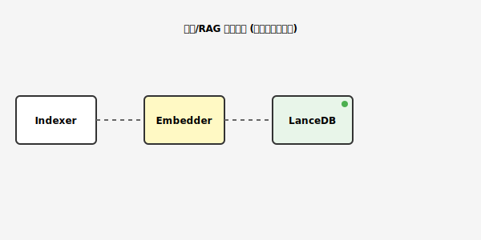

# 知识与检索模块 (Knowledge/RAG)

负责代码库的语义索引构建、向量存储以及语义检索。

## 核心组件
- `embedder.py`: 封装 `fastembed`，负责将代码块转化为向量。
- `vector_store.py`: 封装 `LanceDB`，负责向量的持久化存储与相似度搜索。
- `indexer_service.py`: 后台异步索引服务，静默扫描工作区并更新索引。

## 模块流程

