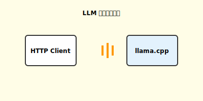

# LLM 模块

负责与各种 LLM 服务提供商进行通信，支持 47+ 家厂商。

## 目录结构

```
llm/
├── __init__.py          # 包导出
├── base.py              # LLMProvider 抽象基类
├── registry.py          # 厂商注册表 (ProviderRegistry)
├── model_manager.py     # 模型管理器 (单例)
├── auto_router.py       # 智能路由 (按任务类型选择模型)
├── cost_tracker.py      # 成本追踪
├── failover.py          # 故障转移
├── image_utils.py       # 图片处理工具
├── llama_cpp_http.py    # 通用 HTTP 客户端 (ChatMessage)
├── streaming_client.py  # 流式客户端
├── providers/           # 厂商实现 (47+)
│   ├── llama_cpp.py     # llama.cpp (默认)
│   ├── openai.py        # OpenAI
│   ├── anthropic.py     # Anthropic
│   └── ...
└── README.md
```

## 核心组件

| 组件 | 职责 |
|------|------|
| `LLMProvider` | 厂商抽象基类，定义统一接口 |
| `ProviderRegistry` | 厂商注册与发现 |
| `ModelManager` | 全局模型/厂商管理 |
| `AutoRouter` | 按任务类型智能选择模型 |
| `CostTracker` | Token 用量与成本统计 |
| `FailoverManager` | 自动故障转移 |

## 厂商分类

| 类型 | 数量 | 代表 |
|------|------|------|
| 本地推理 | 6 | llama.cpp, Ollama, LocalAI |
| 国际云厂商 | 12 | OpenAI, Anthropic, Google, AWS |
| 国内云厂商 | 15 | DeepSeek, 智谱, 通义千问, 文心 |
| 推理平台 | 14 | Groq, Together, Replicate, HuggingFace |

## 命名规范

### 文件命名

```python
# ✅ 单一厂商
openai.py, anthropic.py, deepseek.py

# ✅ 组合厂商 (厂商_产品)
azure_openai.py, google_gemini.py, aws_bedrock.py

# ✅ 功能模块
base.py, registry.py, model_manager.py
```

### Provider 类规范

```python
@ProviderRegistry.register("my_provider")  # ID 与文件名一致
class MyProvider(LLMProvider):
    PROVIDER_ID = "my_provider"      # 必须
    PROVIDER_NAME = "My Provider"    # 必须，显示名称
    PROVIDER_TYPE = "cloud"          # cloud | local | aggregator
    REGION = "海外"                  # 海外 | 国内 | 通用
```

## 使用示例

```python
from clude_code.llm import get_model_manager, switch_provider

# 获取管理器
mm = get_model_manager()

# 列出厂商
providers = mm.list_providers()

# 切换厂商
switch_provider("openai", model="gpt-4o")

# 获取当前 Provider
provider = mm.get_current_provider()
response = provider.chat(messages)
```

## 模块流程



## 文档

- [命名规范分析](../../docs/LLM_MODULE_NAMING_ANALYSIS.md)
- [多厂商设计文档](../../docs/FEATURE_MULTI_PROVIDER_DESIGN.md)
- [llama.cpp Provider](../../docs/IMPL_LLAMA_CPP_PROVIDER.md)
