# 可观测性模块

负责记录 Agent 的全量行为日志，包括审计日志和调试轨迹。

## 核心组件
- `audit.py`: 记录关键行为（工具调用、修改操作）的 JSONL 审计日志。
- `trace.py`: 记录详细的执行轨迹，用于问题复现与流程分析。
- `logger.py`: **统一日志系统**（带文件名和行号，支持 Rich markup）

## 日志系统使用

### 基本用法

```python
from clude_code.observability.logger import get_logger

logger = get_logger(__name__)
logger.info("这是一条信息日志")
logger.warning("这是一条警告日志")
logger.error("这是一条错误日志")
```

### 快捷函数

```python
from clude_code.observability.logger import info, warning, error

info("快速信息日志")
warning("快速警告日志")
error("快速错误日志")
```

### 日志格式

所有日志输出格式为：`[文件名:行号] 日志级别 - 消息内容`

例如：
```
[main.py:48] INFO - 进入 clude chat（llama.cpp HTTP）
[main.py:680] ERROR - workspace_root 不存在
```

### 支持 Rich Markup

日志系统支持 Rich 的 markup 语法，可以添加颜色和样式：

```python
logger.info("[bold]重要信息[/bold]")
logger.error("[red]错误信息[/red]")
logger.warning("[yellow]警告信息[/yellow]")
```

## 模块流程


