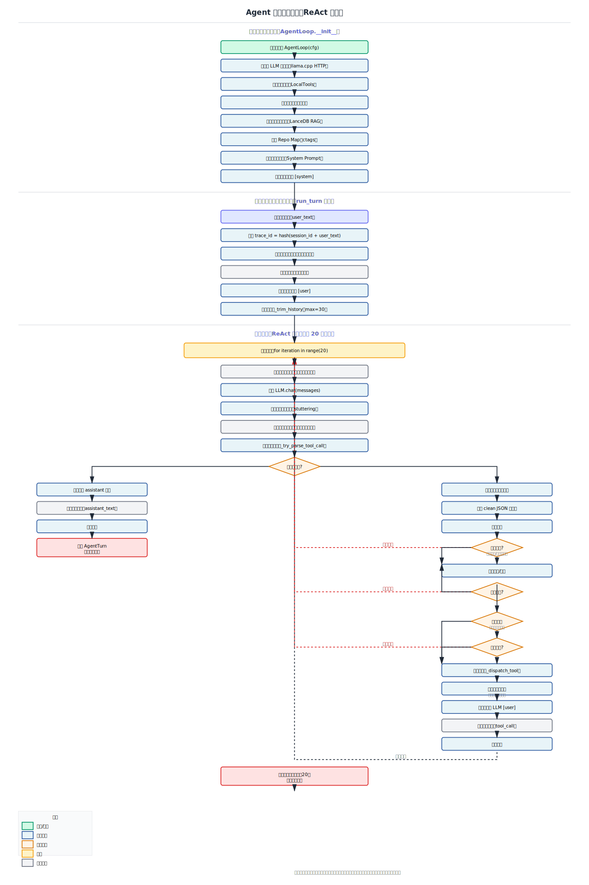

# 核心编排模块 (Orchestrator)

项目的“大脑”，负责 Agent 的状态流转、任务拆解与决策逻辑。

## 核心能力
- **ReAct 循环**: 实现“思考-行动-观测”的自主循环。
- **人格硬化 (Persona Hardening)**: 强化的 System Prompt，确保 Agent 保持工程执行者身份，拒绝推诿。
- **吐字防抖 (Stuttering Detection)**: 自动识别并拦截模型输出的异常重复字符。
- **CoT 自动剥离**: 在存入历史记录前自动剔除思维链（<thought>），减少模型受自身噪音干扰。
- **上下文压缩**: 智能的历史记录裁剪与工具返回结果的结构化压缩。

## 关键文件
- `agent_loop.py`: 主循环实现，集成工具分发与策略校验。

## 函数流程图

`agent_loop.py` 中每个核心函数都有详细的流程图：

1. **`_try_parse_tool_call`** - 从 LLM 输出中解析工具调用 JSON
   - 流程图: 

2. **`_tool_result_to_message`** - 将工具结果转换为结构化消息
   - 流程图: 

3. **`AgentLoop.__init__`** - 初始化 Agent 循环
   - 流程图: 

4. **`AgentLoop.run_turn`** - 执行一轮完整的 ReAct 循环
   - 流程图: 

5. **`AgentLoop._trim_history`** - 裁剪对话历史以控制上下文窗口
   - 流程图: 

6. **`AgentLoop._dispatch_tool`** - 根据工具名称分发到对应执行函数
   - 流程图: 

7. **`AgentLoop._semantic_search`** - 执行向量 RAG 语义搜索
   - 流程图: 

## 核心规范与协议

为了保证模块化开发的协作精度，我们定义了标准的数据契约：

- **数据模型协议**: [`PROTOCOLS.md`](PROTOCOLS.md) - 包含 Plan、Step、VerificationResult 的 JSON Schema 及异常处理策略。

## 完整执行流程

详细的 Agent 执行流程说明和流程图：

- **详细流程文档**: [`AGENT_FLOW_DETAILED.md`](AGENT_FLOW_DETAILED.md) - 包含完整的流程说明、设计决策和关键机制
- **动画流程图**:  - 可视化展示从初始化到返回结果的完整执行路径

## 与业界标准对比分析

详细的对比分析文档，识别当前实现与业界标准（Claude Code、Aider、Cursor）的差距：

- **对比分析文档**: [`AGENT_VS_INDUSTRY_ANALYSIS.md`](AGENT_VS_INDUSTRY_ANALYSIS.md) - 基于 8 个维度的详细对比，包含问题分析、评分对比和改进建议

### 流程概览

1. **初始化阶段**: 创建 LLM 客户端、工具集、RAG 系统，构建系统提示词
2. **用户输入处理**: 生成 trace_id，提取关键词，更新消息历史
3. **ReAct 循环**（最多 20 次）:
   - LLM 请求 → 响应解析 → 工具调用解析
   - 策略检查（用户确认、命令黑名单）
   - 工具执行 → 结果回喂 → 历史裁剪
4. **返回结果**: AgentTurn（包含最终文本、工具使用标志、追踪ID、事件列表）

## 模块流程

