# 用户问「你可以干嘛啊？」——正确分析流程说明（含 SVG 流程图）

> 生成日期：2026-01-13  
> 目的：给出**可落地、可验收**的“正确分析/决策流程”，避免把能力询问误当成代码任务导致无意义工具调用或 llama.cpp 500。

---

## 1. 这类问题的本质

「你可以干嘛啊？」属于**能力/帮助说明（元问题）**，业界一般把它归类为：

- **Help / Capability Inquiry**
- **Onboarding / How-to**

它不是“立即执行代码任务”的指令，因此默认策略是：

- **不进入规划（Plan）**  
- **不触发工具调用（list_dir/grep/run_cmd 等）**  
- 直接输出：**能力清单 + 使用方式 + 安全边界**

---

## 2. 为什么要这么做（业界对比）

### 2.1 业界共识

在 Cursor / Claude Code / Copilot Chat 等产品中，遇到能力询问时：

- 会优先输出“我能做什么 / 我不能做什么 / 你怎么提问更高效”
- **不会**立刻去读仓库、跑命令或生成复杂 Plan（否则用户体验非常差）

### 2.2 本项目的额外约束：llama.cpp role 交替

你之前遇到的 500：`Conversation roles must alternate user/assistant/...`  

这说明：即使是“只是回答一句能力说明”，只要进入“工具回喂 + 下一轮提示”的路径，就可能构造出连续 `user/user`，从而触发后端模板硬校验。

因此本项目采用业界同等稳健的做法：在**发送前**做一次 messages 序列规范化（单点兜底），确保满足 llama.cpp 的模板契约。

---

## 3. 正确分析/决策流程（可视化）

- **SVG（动画版）**：`src/assets/user_query_capabilities_flow_animated.svg`

---

## 4. 正确流程的“文字版步骤”（用于测试用例/验收）

当用户输入：「你可以干嘛啊？」

1. **INTAKE**：记录审计、生成 trace_id（可观测）
2. **分类**：识别为“能力询问/帮助说明”
3. **决策门**：不进入规划、不调用工具
4. **回答结构**（模板化输出）：
   - 我能做什么（工具能力）
   - 我不能做什么（安全边界）
   - 你怎么提问更高效（给 2-3 个提问例子）
5. **生成输出**：通过统一出口 `_llm_chat(stage="capabilities")`（发送前会触发 `messages_normalized` 兜底）
6. **输出校验**：若模型误输出工具调用 JSON，则提示“此问题不需要工具，请输出自然语言能力说明”，再生成一次
7. **DONE**：返回最终文本，保留 UI 状态与 trace 事件

---

## 5. 期望输出的“能力清单”建议结构（示例）

> 下面不是固定话术，而是建议结构，便于一致性与可测试性。

### 5.1 我可以做什么（按能力分组）

- **文件系统**
  - `list_dir`：列目录
  - `read_file`：读文件（支持 offset/limit）
  - `glob_file_search`：按模式找文件
- **代码搜索**
  - `grep`：高性能文本搜索（优先 `rg`）
  - `search_semantic`：语义检索（LanceDB）
- **代码修改**
  - `apply_patch`：精确补丁修改（含回滚证据链）
  - `undo_patch`：回滚补丁
- **命令执行**
  - `run_cmd`：运行命令（受策略限制）
- **验证闭环**
  - 工具后自动触发 `Verifier`（pytest/npm/go/cargo 等）

### 5.2 我不会做什么（安全边界）

- 默认不执行危险命令（如破坏性删除、越权操作）
- 写文件/执行命令需要用户确认（可配置）
- 不泄露敏感信息（token、密码等）

### 5.3 你怎么问更高效（给可执行格式）

- 示例 1：`请在 src/xxx.py 中修复 xxx bug，并跑验证`
- 示例 2：`帮我找出项目里处理向量存储的入口文件，并解释调用链`
- 示例 3：`把 docs/xx.md 改成与 src/INDUSTRY_ANALYSIS.md 同格式`

---

## 6. 与业界对比结论

- **一致点**：能力询问 → 直接给能力说明（不跑工具/不做 plan），提升体验与稳定性
- **差异点**：本项目因为 llama.cpp 模板更严格，必须额外做“发送前 messages 规范化”，这是本地推理栈常见的工程代价

